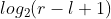
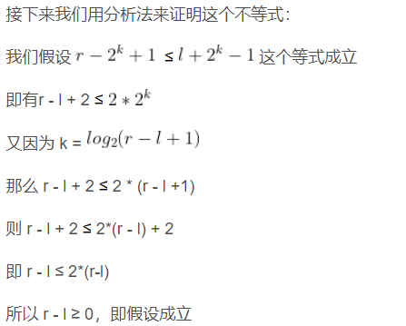
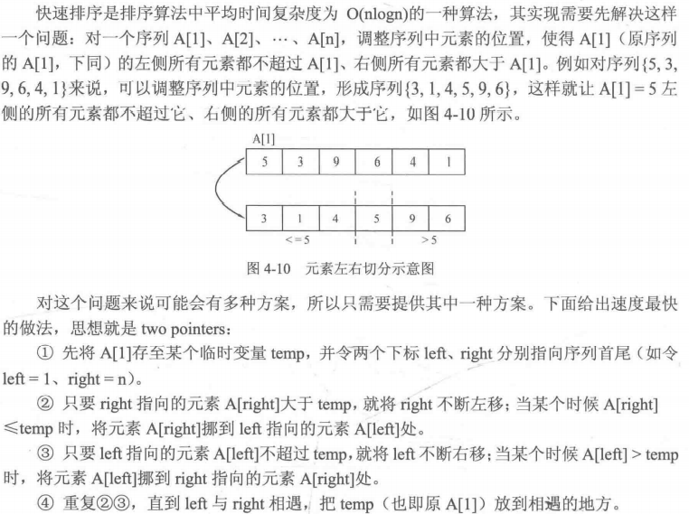
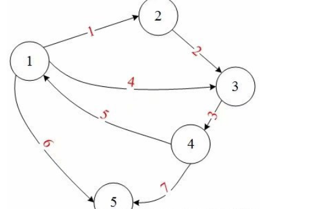
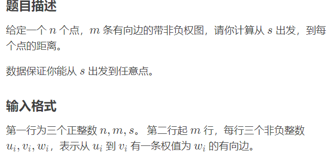
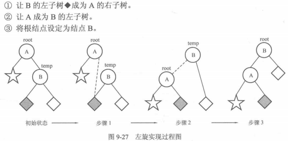
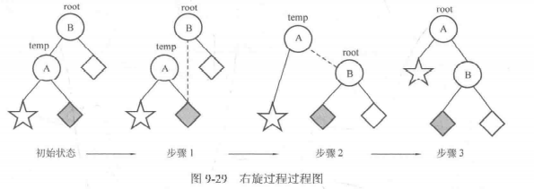

##差分序列

###前言

差分序列常用于维护需要进行区间加操作的序列，但是无法做到区间查询。


### 原理

已知一组序列，用数组a保存。a~i~表示序列第i个元素。建立一个数组b，其元素取值如下：

​																	**b~i~ = a~i~ - a~i-1~**

因此有**a~1~ = b~1~， a~i~ = b~i~ + a~i-1~**，此处在用数组的时候，a~0~ = 0，下标从1开始存储数据

由于差分序列的性质，当我们对[l, r]这个区间统一进行加d操作时，只需要对

​													**b~l~ += d， b~r+1~ -= d**

###代码示例

```c
#include <stdio.h>
int a[5000004];
int d[5000004];

void add(int x, int y, int z)
{
	d[x] += z;
	d[y + 1] -= z;
}

int main(void)
{
	int n, p;//n个数组，进行p次区间加操作
	scanf("%d %d", &n, &p);
	for (int i = 1; i <= n; i++)
	{
		scanf("%d", &a[i]);
	}
    
    //求出初始d数组的值
	for (int i = 1; i <= n; i++)
		d[i] = a[i] - a[i - 1];
    
    //进行p次区间加操作
	int x, y, z;
	for (int i = 1; i <= p; i++)
	{
		scanf("%d %d %d", &x, &y, &z);
		add(x, y, z);
	}

    //计算最小值
	a[1] = d[1] + a[0];
	int min = a[1];
	for (int i = 2; i <= n; i++)
	{
		a[i] = d[i] + a[i - 1];
		if (min > a[i])
			min = a[i];
	}

	printf("%d", min);
	return 0;

}
```


## RMQ

### 问题描述

给你一个数组 ，其中有N个数字，现在给你一次询问，给你区间[l ，r]，问你在这个区间内的最大值为多少?

### 算法描述

####初始化

RMQ（Range Minimum/Maximum Query），即区间最值查询。RMQ算法一般用较长时间做预处理，时间复杂度为O(nlogn)，然后可以在O（1）的时间内处理每次查询。

下面我们从一个实际问题来解释RMQ

我们假设数组arr为：1，2，6，8，4，3，7

我们设二维数组dp[i][j]表示从第i位开始连续  个数中的最小值。例如dp[2][1]就表示从第二位数开始连续两个数的最小值（也就是从第二位数到第三位数的最小值），即2，6中的最小值，所以dp[2][1] = 2;

其实我们求 dp[i][j] 的时候可以把它分成两部分，第一部分是从  到  ，第二部分从到 ，为什么可以这么分呢？其实我们都知道二进制数前一个数是后一个的两倍，那么可以把  到  这个区间通过分成相等的两部分， 那么转移方程很容易就写出来了。（dp[i] [0]就表示第i个数字本身）

​					**dp[i] [j] = min(dp [i] [j - 1], dp [i + (1 << j - 1)] [j - 1])**

注：加减的优先级比位运算的优先级高

代码：

```c
void rmq_init()
{
    for(int i=1;i<=N;i++)
        dp[i][0]=arr[i];//初始化
    for(int j=1;(1<<j)<=N;j++)
        for(int i=1;i+(1<<j)-1<=N;i++)
            dp[i][j]=min(dp[i][j-1],dp[i+(1<<j-1)][j-1]);
}
```

这里需要注意一个循环变量的顺序，我们看到外层循环变量为j，内层循环变量为i，这是为什么呢？可以互换一下位置吗？

答案当然是不可以，我们要理解这个状态转移方程的意义，这个状态方程的含义是：先更新每两个元素中的最小值，然后通过每两个元素的最小值获得每4个元素中的最小值，依次类推更新所有长度的最小值。

#### 查询

假设我们需要查询区间[l ，r]中的最小值，**令k = ** ， 则区间[l, r]的最小值RMQ[l,r] = min(dp[l] [k], dp[r - (1 << k) + 1] [k]);

dp[l][k]维护的是区间 [l, l + 2^k - 1] , dp[r - (1 << k) + 1][k]维护的是区间 [r - 2^k + 1, r] 。

那么只要我们保证  ≤ 就能保证RMQ[l,r] = min(dp[l] [k], dp[r - (1 << k) + 1] [k])；




```c

int rmq(int l,int r)
{
    int k=log2(r-l+1);
    return min(dp[l][k],dp[r-(1<<k)+1][k]);
}

```


### 单调栈


```c++
#include <cstdio>
#include <stack>
using namespace std;
int n, a[3000003], f[3000003];

int main(void)
{
	stack<int> s;
	scanf("%d", &n);
	for (int i = 1; i <= n; i++)
	{
		scanf("%d", &a[i]);
	}

    //从后往前取数组中的元素，和栈中的元素进行比较
    //保持栈中的元素往栈顶方向递减
    //栈中保存的是元素在数组中的位置
	for (int i = n; i >= 1; i--)
	{
		while (!s.empty() && a[i] >= a[s.top()]) 
			s.pop();

		f[i] = s.empty() ? 0 : s.top();
		s.push(i);
	}

	for (int i = 1; i <= n; i++)
		printf("%d ", f[i]);

	return 0;
}
```


### 归并排序

```cpp
#include <stdlib.h>
#include <stdio.h>

void Merge(int sourceArr[],int tempArr[], int startIndex, int midIndex, int endIndex)
{
    int i = startIndex, j=midIndex+1, k = startIndex;

    while(i!=midIndex+1 && j!=endIndex+1)
    {
        if(sourceArr[i] > sourceArr[j])
            tempArr[k++] = sourceArr[j++];
        else
            tempArr[k++] = sourceArr[i++];
    }

    while(i != midIndex+1)
        tempArr[k++] = sourceArr[i++];

    while(j != endIndex+1)
        tempArr[k++] = sourceArr[j++];
        
    for(i=startIndex; i<=endIndex; i++)
        sourceArr[i] = tempArr[i];
}


//内部使用递归
void MergeSort(int sourceArr[], int tempArr[], int startIndex, int endIndex)
{
    int midIndex;
    if(startIndex < endIndex)
    {
        midIndex = startIndex + (endIndex-startIndex) / 2;//避免溢出int
        MergeSort(sourceArr, tempArr, startIndex, midIndex);
        MergeSort(sourceArr, tempArr, midIndex+1, endIndex);
        Merge(sourceArr, tempArr, startIndex, midIndex, endIndex);
    }
}


int main(int argc, char * argv[])
{
    int a[8] = {50, 10, 20, 30, 70, 40, 80, 60};
    int i, b[8];
    MergeSort(a, b, 0, 7);
    for(i=0; i<8; i++)
        printf("%d ", a[i]);
    printf("\n");
    system("pause");
    return 0;
}
```


### 快速排序



用以划分区间的元素A[left]被称为主元：

```cpp
//对区间[left, right]进行划分
int Partition(int A[], int left, int right)
{
    int temp = A[left];  //将A[left]存放至临时变量temp
    
    while(left < right)  //只要left与right不相遇
    {
        while(left < right && temp < A[right])  //反复左移right
            right--;
        A[left] = A[right];  //将A[right]挪到A[left]
        
        while(left < right && temp >= A[left])  //反复右移left
            left++;
        
        A[right] = A[left];  //将A[left]挪到A[right]
    }
    A[left] = temp;  //把temp放到left与right相遇的地方
    return left;  //返回相遇的下标
}
```

快速排序的思路是：

1. 调整序列中的元素，使当前序列最左端的元素在调整后满足左侧所有元素均不超过该元素、右侧所有元素均大于该元素。
2. 对该元素的左侧和右侧分别递归进行1.的调整，知道当前调整区间的长度不超过1.

```cpp
//快速排序，left与right初值为序列首尾下标
void quickSort(int A[], int left, int right)
{
    if(left < right)  //当前区间的长度不超过1
    {
        int pos = Partition(A[], left, right);
        quickSort(A[], left, pos - 1);  //对左子区间递归进行快速排序
        quickSort(A[], pos + 1, right);  //对右子区间递归进行快速排序
    }
}
```

### 随机数

```cpp
#include <stdio.h>

//以下为需要添加的头文件
#include <stdlib.h>
#include <time.h>

int main()
{
	srand((unsigned)time(NULL));  //生成随机数的种子
	for (int i = 0; i < 10; i++)
		printf("%d ", rand());  //rand()为生成随机数的函数
    
    for (int i = 0; i < 10; i++)
		printf("%d ", rand() % 2);  //[0, 1]
    
    for (int i = 0; i < 10; i++)
		printf("%d ", rand() % 5 + 3);  //[3, 7]
    
    
    
}
```

rand()函数只能生成[0, RAND_MAX]范围内的整数（RAND_MAX是stdlib.h中的一个常数，在不同系统环境中，该常数的值可能不同）。因此如果想要输出给定范围[a, b]内的随机数，需要使用rand() % (b - a + 1) + a。显然 rand() % (b - a + 1)的范围是[0, b - a]，再加上a之后就是[a, b]。


## 并查集

### 初始化

```cpp
for(int i = 1; i <= N; i++)
{
    father[i] = i;  //令father[i]为-1也可
}
```


### 查找

规定一个集合中只存在一个根结点，因此查找操作就是对给定的结点寻找其根结点的过程。实现的方式可以是递推或递归，思路都是反复寻找父亲结点，知道找到根结点（father[x] = x）

递推

```cpp
//findFather函数返回元素x所在集合的根结点
int findFather(int x)
{
    while(x != father[x])  //如果不是根结点，继续循环
    {
        x = father[x];  //获得自己父亲的根结点
    }
    return x;
}
```


递归

```cpp
int findFather(int x)
{
    if(x == father[x])  //如果找到根结点，则返回根结点编号x
        return x;
    else                //否则，递归判断x的父亲结点是否是根结点
        return findFather(father[x]);
}
```


### 合并

```cpp
void Union(int a, int b)
{
    int faA = findFather(a);  //查找a的根结点，即为faA
    int faB = findFather(b);  //查找b的根结点，即为faB
    if(faA != faB)			  //如果不属于同一个集合
        father[faA] = faB;    //合并它们
}
```

### 路径压缩

把当前查询结点的路径上的所有结点的父亲都指向根结点

转换的步骤：

1. 按原先的写法获得x的根结点r
2. 重新从x开始走一遍寻找根结点的过程，把路径上经过的所有结点的父亲全部改为根结点r

```cpp
int findFather(int x)
{
    //由于x在下面的while中会变成根结点，因此先把原先的x保存一下
    int a = x;
    
    //寻找根结点
    while(x != father[x])
        x = father[x];
    
    //到这里，x存放的是根结点，下面把路径上的所有结点的father都改成根结点
    while(a != father[a])
    {
        int z = a;  //因为a要被father[a]覆盖，所以先保存a的值，以修改father[a]
        a = father[a];  //a回溯父亲结点
        father[z] = x;  //将原先的结点a的父亲改为根结点x
    }
    
    return x;  //返回根结点
}
```


递归写法

```cpp
int findFather(int v)
{
    if(v == father[v])  //找到根结点
        return v;
    else
    {
        int F = findFather(father[v]);  //递归寻找father[v]的根结点F
        father[v] = F;					//将根结点F赋给father[v]
        return F;						//返回根结点F
    }
}
```


## 最小生成树

###kruskal算法

```cpp
#include <stdio.h>
#include <algorithm>
using namespace std;
const int MAXV = 110;
const int MAXE = 10010;

//边集定义部分
struct edge {
	int u, v;  //边的两个端点编号
	int cost;  //边权
}E[MAXE];  //最多有MAXE条边

bool cmp(edge a, edge b)
{
	return a.cost < b.cost;
}

//并查集部分
int father[MAXV];  //并查集数组

//并查集查询函数
int findFather(int x)
{
	int a = x;

	while (x != father[x])
		x = father[x];

	//路径压缩
	while (a != father[a])
	{
		int z = a;
		a = father[a];
		father[z] = x;
	}

	return x;
}

//kruskal部分，返回最小生成树的边权之和，参数n为顶点个数，m为图的边数
int kruskal(int n, int m)
{
	//ans为所求边权之和，Num_Edge为当前生成树的边数
	int ans = 0, Num_Edge = 0;

	for (int i = 0; i < n; i++) //顶点范围是[0, n-1]
	{
		father[i] = i;//并查集初始化
	}

	sort(E, E + m, cmp);  //所有边按边权从小到大排序

	for (int i = 0; i < m; i++)  //枚举所有边
	{
		int faU = findFather(E[i].u);  //查询测试边两个端点所在集合的根结点
		int faV = findFather(E[i].v);
		if (faU != faV)  //如果不在一个集合中
		{
			father[faU] = faV;  //合并集合（即把测试边加入最小生成树中）
			ans += E[i].cost;   //边权之和增加测试边的边权
			Num_Edge++;  //当前生成树的边数加1
			if (Num_Edge == n - 1)
				break;  //边数等于顶点数减1时结束算法

		}
	}

	if (Num_Edge != n - 1)
		return -1;  //无法连通时返回-1
	else
		return ans;  //返回最小生成树的边权之和
}

int main(void)
{
	int n, m;
	scanf("%d %d", &n, &m);  //顶点数、边数
	for (int i = 0; i < m; i++)
	{
		scanf("%d %d %d", &E[i].u, &E[i].v, &E[i].cost);  //两个端点编号、边权
	}

	int ans = kruskal(n, m);  //kruskal算法入口
	printf("%d", ans);

	return 0;
}
```

### prim算法

```cpp
#include <stdio.h>
#include <algorithm>
using namespace std;
const int MAXV = 1000;  //最大顶点数
const int INF = 1000000000;  //设INF为一个很大的数

int n, m, G[MAXV][MAXV];  //n为顶点数，
int d[MAXV];  //顶点与集合S的最短距离
bool vis[MAXV] = { false };  //标记数组，vis[i] == true表示已访问，初值均为false

int prim()  //默认0号为初始点，函数返回最小生成树的边权之和
{
	fill(d, d + MAXV, INF);  //fill函数将整个d数组赋值为INF
	d[0] = 0;  //只有0号顶点到集合S的距离为0，其余全为INF
	int ans = 0;  //存放最小生成树的边权之和

	for (int i = 0; i < n; i++)  //循环n次
	{
		int u = -1, MIN = INF;  //u使d[u]最小，MIN存放最小的d[u]

		for (int j = 0; j < n; j++)  //找到未访问的顶点中的d[]最小的
		{
			if (vis[j] == false && d[j] < MIN)
			{
				u = j;
				MIN = d[j];
			}
		}

		//找不到小于INF的d[u]，则剩下的顶点和集合S不连通
		if (u == -1)
			return -1;

		vis[u] = true;  //标记u为已访问

		ans += d[u];  //将与集合S距离最小的边加入最小生成树

		for (int v = 0; v < n; v++)
		{
			//v未访问 && u能到达v && 以u为中介点可以使v离集合S更近
			if (vis[v] == false && G[u][v] != INF && G[u][v] < d[v])
			{
				d[v] = G[u][v];  //将G[u][v]赋值给d[v]
			}
		}


	}
	return ans;  //返回最小生成树的边权之和

}

int main(void)
{
	int u, v, w;
	scanf("%d %d", &n, &m); // 顶点个数、边数
	fill(G[0], G[0] + MAXV * MAXV, INF);  //初始化图G

	for (int i = 0; i < m; i++)
	{
		scanf("%d %d %d", &u, &v, &w);  //输入u、v以及边权
		G[u][v] = G[v][u] = w;  //无向图
	}

	int ans = prim(); //prim算法入口
	printf("%d", ans);
	return 0;
}
```


## 链式前向星

```cpp
我们建立边结构体为:

struct Edge

{
     int next;
     int to;
     int w;
}edge[MAXE];
其中：
edge[i].to表示第i条边的终点,
edge[i].next表示与第i条边同起点的下一条边的存储位置,
edge[i].w为边权值.
```

另外还有一个数组head[]，head[i]用来表示以i为起点的第一条边存储的位置，实际上你会发现这里的第一条边存储的位置其实在以i为起点的所有边的最后输入的那个编号

head[]数组一般初始化为-1

```cpp
void add_edge(int u, int v, int w){ //加边函数。u为起点，v为终点，w为边权

    edge[cnt].to=v; //终点

    edge[cnt].w=w; //权值

    edge[cnt].next=head[u]; //以u为起点的最后一条边的编号

    head[u]=cnt++; //更新以u为起点的上一条边的编号

}
```

在这里进行边的衔接的时候颇似栈，next更像是last（上一个）

```markdown
给你一组数据：
第一行表示 5 个顶点 7 条边
接下来是7条边的起点、终点和权值

5 7
1 2 1
2 3 2
3 4 3
1 3 4
4 1 5
1 5 6
4 5 7

```



```markdown
依据next，head数组的约定，并按边的输入顺序从0开始对边进行编号，
然后按照上面的数据就可以写出下面的过程：

对于1 2 1这条边：edge[0].to=2;   edge[0].next=-1;    head[1]=0;

对于2 3 2这条边：edge[1].to=3;   edge[1].next=-1;    head[2]=1;

对于3 4 3这条边：edge[2].to=4;   edge[2],next=-1;    head[3]=2;

对于1 3 4这条边：edge[3].to=3;   edge[3].next= 0;    head[1]=3;

对于4 1 5这条边：edge[4].to=1;   edge[4].next=-1;    head[4]=4;

对于1 5 6这条边：edge[5].to=5;   edge[5].next= 3;    head[1]=5;

对于4 5 7这条边：edge[6].to=5;   edge[6].next= 4;    head[4]=6;

很明显,head[i]保存的是以i为起点的所有边中编号最大的那个,而把这个当作顶点i的第一条起始边的位置.
```

注：边数组从0开始计数，顶点编号从1开始

```cpp
遍历函数如下：
for(int i=1; i<=n; i++){ //n个起点    
        cout<<i<<endl;
        for(int j=head[i]; j!=-1; j=edge[j].next) //遍历以i为起点的所有边        
            cout<<i<<" "<<edge[j].to<<" "<<edge[j].w<<endl;
        cout<<endl;
    }

第一层for循环：依次遍历以1...n为起点的边的集合。
第二层for循环：遍历以i为起点的所有边，j首先等于head[i]。
注意：head[i]表示与点i起点相同的最后一条边的编号。
然后，通过edge[j].next来找与边j起点相同的上一条边的编号，终止条件为edge[j].next=-1。

```

**总结性代码**

```cpp
#include<bits/stdc++.h>
using namespace std;
const int maxn = 1005;//点数最大值
int n, m, cnt;//n个点，m条边
struct Edge
{
    int to, w, next;//终点，边权，同起点的上一条边的编号
}edge[maxn];//边集
int head[maxn];//head[i],表示以i为起点的第一条边在边集数组的位置（编号）
void init()//初始化
{
    for (int i = 0; i <= n; i++) head[i] = -1;
    cnt = 0;
}
void add_edge(int u, int v, int w)//加边，u起点，v终点，w边权
{
    edge[cnt].to = v; //终点
    edge[cnt].w = w; //权值
    edge[cnt].next = head[u];//以u为起点上一条边的编号，也就是与这个边起点相同的上一条边的编号
    head[u] = cnt++;//更新以u为起点上一条边的编号
}
int main()
{
    cin >> n >> m;
    int u, v, w;
    init();//初始化
    for (int i = 1; i <= m; i++)//输入m条边
    {
        cin >> u >> v >> w;
        add_edge(u, v, w);//加边
        /*
        加双向边
        add_edge(u, v, w);
        add_edge(v, u, w);
        */
    }
    for (int i = 1; i <= n; i++)//n个起点
    {
        cout << i << endl;
        for (int j = head[i]; j != -1; j = edge[j].next)//遍历以i为起点的边
        {
            cout << i << " " << edge[j].to << " " << edge[j].w << endl;
        }
        cout << endl;
    }
    return 0;
}
【测试样例】

in：

5 7
1 2 1
2 3 2
3 4 3
1 3 4
4 1 5
1 5 6
4 5 7

out：

1 //以1为起点的边的集合
1 5 6
1 3 4
1 2 1

2 //以2为起点的边的集合

2 3 2 

3 //以3为起点的边的集合
3 4 3

4 //以4为起点的边的集合
4 5 7
4 1 5

5 //以5为起点的边不存在

```


## 单调队列


## 进制哈希


## 最短路径

### Dijkstra算法


####堆优化

堆优化即使用stl的优先队列，优先队列就是用堆存储的



```cpp
//洛谷P4779
#include <iostream>
#include <queue>
#include <algorithm>
using namespace std;

const int maxn = 100005;
const int maxm = 200005;
const int INF = 0x3fffffff;

//链式前向星部分
int cnt, head[maxn];

struct edge {
	int to;
	int dis;
	int next;
}e[maxm];

void add(int u, int v, int dis)
{
	cnt++;
	e[cnt].to = v;
	e[cnt].dis = dis;
	e[cnt].next = head[u];
	head[u] = cnt;
}

//图的相关结构部分
struct node {
	int to;
	int dis;
	node(int _to, int _dis) : to(_to), dis(_dis) {}
	friend bool operator < (node a, node b)
	{
		return a.dis > b.dis;
	}
};

bool vis[maxn];  //访问数组
int d[maxn];  //距离数组
int n, m, s;  //n个点，m条有向边，起点为s

void dijkstra(int s)
{
	priority_queue<node> q;
	fill(d + 1, d + maxn, INF);
	d[s] = 0;
	q.push(node(s, 0));

	while (!q.empty())
	{
		node tmp = q.top();
		q.pop();
		if (vis[tmp.to])
			continue;

		vis[tmp.to] = true;
		d[tmp.to] = tmp.dis;
		for (int i = head[tmp.to]; i; i = e[i].next)
		{
			int v = e[i].to;
			int dis = e[i].dis;
			if (vis[v] == false && d[v] > d[tmp.to] + dis)
			{
				d[v] = d[tmp.to] + dis;
				q.push(node(v, d[v]));
			}
		}

	}
}

int main()
{
	cin >> n >> m >> s;
	int u, v, w;
	for (int i = 1; i <= m; i++)
	{
		cin >> u >> v >> w;
		add(u, v, w);
	}

	dijkstra(s);
	for (int i = 1; i <= n; i++)
	{
		cout << d[i] << " ";
	}
}
```


####普通版

邻接表

```cpp
struct Node{
  int v, dis;  //v为边的目标顶点，dis为边权
};

vector<Node> Adj[MAXV];  //图G，Adj[u]存放从顶点u出发可以到达的所有顶点
int d[MAXV];  //n为顶点数，图G使用邻接表实现，MAXV为最大顶点数
int n;
int d[MAXV];  //起点到达各点的最短路径长度
bool vis[MAXV] = {false};  //标记数组

void Dijkstra(int s)
{
    fill(d, d + MAXV, INF);
	
    for(int i = 0; i < n; i++)
    {
        int u = -1;
    	int MIN = INF;
        for(int j = 0; j < n; j++)
        {
            if(vis[j] == false && d[j] < MIN)
            {
                u = j;
                MIN = d[j];
            }
        }
        
        if(u == -1)
            return;
        vis[u] = true;
        
        for(int j = 0; j < Adj[u].size(); j++)
        {
            int v = Adj[u][j].v;
            int dis = Adj[u][j].dis;
            if(vis[v] == false && d[u] + dis < d[v])
                d[v] = d[u] + dis;
        }
    }
}
```


以下为邻接矩阵

```cpp
#include <stdio.h>
#include <algorithm>
using namespace std;

int n, m, s;  //n为顶点数，m为边数， s为起点
const int INF = 1000000000;  //设INF是一个很大的数
const int MAXV = 1000;  //最大顶点数
int d[MAXV];
int G[MAXV][MAXV];
bool vis[MAXV] = {false};  //标记数组，vis[i] == true表示已访问。初值均为false

void Dijkstra(int s)  //s为起点
{
    fill(d, d + MAXV, INF);
    
    d[s] = 0;  //起点s到达自身的距离为0
    
    for(int i = 0; i < n; i++)  //循环n次
    {
        int u = -1;
        int MIN = INF;  //u使d[u]最小，MIN存放该最小的d[u]
        for(int j = 0; j < n; j++)  //找到未访问的顶点中d[]最小的
        {
            if(vis[j] == false && d[j] < MIN)
            {
                u = j;
                MIN = d[j];
            }
        }
        
        //找不到小于INF的d[u]，说明剩下的顶点和起点s不连通
        if(u == -1)
            return;
        
        vis[u] = true;  //标记u为已访问
        
        for(int v = 0; v < n; v++)  //遍历所有的顶点
        {
            //如果v未访问 && u能到达v && 以u为中介点可以使f[v]更优
            if(!vis[v] && G[u][v] != INF && d[u] + G[u][v] < d[v])
                d[v] = d[u] + G[u][v];  //优化d[v]
        }
    }
    
}

int main()
{
    int u, v, w;
    scanf("%d%d%d", &n, &m, &s);  //顶点个数、边数、起点编号
    fill(G[0], G[0] + MAXV * MAXV, INF);  //初始化图G
    
    for(int i = 0; i < m; i++)
    {
        scanf("%d%d%d", &u, &v, &w);  //输入u，v以及u->v的边权
        G[u][v] = w;
    }
    
    Dijkstra(s);  //Dijkstra算法入口
    
    for(int i = 0; i < n; i++)
        printf("%d ", d[i]);  //输出所有顶点的最短距离
    
    return 0;
}
```


上面的算法中提到的“以u为中介点可以使起点s到顶点v的最短距离d[v]更优”隐含了：使d[v]变得更小的方案是让u作为从s到v的最短路径上v的前一个结点。不妨把这个信息记录下来，设置一个数组pre[]。令pre[v]表示从起点s到顶点v的最短路径v的前一个顶点（即前驱结点）的编号。

伪代码增加处：

```cpp
if(如果v未访问 && u能到达v && 以u为中介点可以使f[v]更优)
{
	优化d[v];
    令u的前驱为u;
}
```

具体实现中：

```cpp
#include <stdio.h>
#include <algorithm>
using namespace std;

int n, m, s;  //n为顶点数，m为边数， s为起点
const int INF = 1000000000;  //设INF是一个很大的数
const int MAXV = 1000;  //最大顶点数
int d[MAXV];
int G[MAXV][MAXV];
bool vis[MAXV] = {false};  //标记数组，vis[i] == true表示已访问。初值均为false
int pre[MAXV];  //pre[v]表示从起点到顶点v的最短路径上v的前一个顶点（新添加）

void Dijkstra(int s)  //s为起点
{
    fill(d, d + MAXV, INF);
    for(int i = 0; i < n; i++)
        pre[i] = i;  //初始状态设每个点的前驱为自身（新添加）
    d[s] = 0;  //起点s到达自身的距离为0
    
    for(int i = 0; i < n; i++)  //循环n次
    {
        int u = -1;
        int MIN = INF;  //u使d[u]最小，MIN存放该最小的d[u]
        for(int j = 0; j < n; j++)  //找到未访问的顶点中d[]最小的
        {
            if(vis[j] == false && d[j] < MIN)
            {
                u = j;
                MIN = d[j];
            }
        }
        
        //找不到小于INF的d[u]，说明剩下的顶点和起点s不连通
        if(u == -1)
            return;
        
        vis[u] = true;  //标记u为已访问
        
        for(int v = 0; v < n; v++)  //遍历所有的顶点
        {
            //如果v未访问 && u能到达v && 以u为中介点可以使f[v]更优
            if(!vis[v] && G[u][v] != INF && d[u] + G[u][v] < d[v])
            {
                d[v] = d[u] + G[u][v];  //优化d[v]
                pre[v] = u;  //记录v的前驱顶点是u（新添加）
            }
        }
    }
    
}
```


求整条路径

```cpp
void DFS(int s, int v)
{
    if(s == v)
    {
        printf("%d ", s);
        return;
    }
    
    DFS(s, pre[v]);
    printf("%d ", v);
    
}
```


#### 新增边权

cost[u] [v]表示u->v的花费（从题目输入），增加一个数组c[]，令从起点s到达顶点u的最少花费为c[u]，初始化时只有c[s]为0、其余为INF。

```cpp
for(int v = 0; v < n; v++)
{
    //如果v未访问 && u能到达v
    if(vis[v] == false && G[u][v] != INF)
    {
        if(d[u] + G[u][v] < d[v])  //以u为中介点可以使d[v]更优
        {
            d[v] = d[u] + G[u][v];
            c[v] = c[u] + cost[u][v];
        }
        else if(d[u] + G[u][v] == d[v] && c[u] + cost[u][v] < c[v])
            c[v] = c[u] + cost[u][v];  //最短距离相同时看能够使c[v]更优
    }
}
```


#### 新增点权

用weight[u]表示城市u中的物资数目（由题目输入），并增加一个数组w[]，令从起点到达顶点u可以收集到的最大物资为w[u]，初始化时只有w[s]为weight[s]、其余w[u]均为0.

```cpp
for(int v = 0; v < n; v++)
{
    if(vis[v] == false && G[u][v] != INF)
    {
        if(d[u] + G[u][v] < d[v])
        {
            d[v] = d[u] + G[u][v];
            w[v] = w[u] + weight[v];
        }
        else if(d[u] + G[u][v] == d[v] && w[u] + weight[v] > w[v])
            w[v] = w[u] + weight[v];  //最短距离相同时看能否使w[v]更优
    }
}
```


#### 最短路径条数

增加一个数组`num[]`，令从起点s到达顶点u的最短路径条数为`num[u]`，初始化时只有num[s]为1、其余均为0。

```cpp
for(int v = 0; v < n; v++)
{
    if(vis[v] == false && G[u][v] != INF)
    {
        if(d[v] > d[u] + G[u][v])
        {
            d[v] = d[u] + G[u][v];
            num[v] = num[u];
        }
        else if(d[v] == d[u] + G[u][v])
            num[v] += num[u];  //最短距离相同时累加num
    }
}
```


```cpp
/*
* 
* 由于本题中图的边权为1，则可以使用BFS算法结合深度来解决
* 
* 如果某结点的相邻结点未访问过，则该相邻结点的最短路等于该结点
* 如果某结点的相邻结点已经访问过且深度大1，则该相邻结点的最短路加上该结点的最短路
* 
*/

#include <iostream>
#include <queue>
using namespace std;

const int maxn = 1000005;
const int mod = 100003;

vector<int> Adj[maxn];  //邻接表存储图
int num[maxn]; //到每一个点的最短路
int depth[maxn];  //每个点的深度值
int N, M;  //图的顶点数和边数
bool vis[maxn];  //访问数组

int main()
{
	cin >> N >> M;//顶点数和边数

	int x, y;
	for (int i = 0; i < M; i++)
	{

		cin >> x >> y;
		Adj[x].push_back(y);
		Adj[y].push_back(x);  //无向无权图
	}

	//初始化
	num[1] = 1;
	depth[1] = 1;
	vis[1] = true;
	queue<int> q;
	q.push(1);

	while (!q.empty())
	{
		int u = q.front();
		q.pop();

		for (int i = 0; i < Adj[u].size(); i++)
		{
			int v = Adj[u][i];
			if (vis[v] == false)  //未访问过
			{
				num[v] = num[u];
				depth[v] = depth[u] + 1;
				vis[v] = true;
				q.push(v);
			}
			else  //已经访问过，其子结点已经处理过，所以不必要再入队
			{
				if (depth[v] == depth[u] + 1)  //深度相差1
				{
					num[v] = (num[u] + num[v]) % mod;
				}
			}
		}
	}

	for (int i = 1; i <= N; i++)
		cout << num[i] << endl;
}


```


### Dijkstra + DFS

 **先在Dijkstra算法中记录下所有最短路径（只考虑距离），然后从这些最短路径中选出一条第二标尺最优的路径**


####Dijkstra

对需要查询某个顶点u是否在顶点v的前驱中的题目，也可以把pre数组设置为set<int>数组，此时使用pre[v].count(u)来查询比较方便

```cpp
vector<int> pre[MAXV];

void Dijkstra(int s)
{
    fill(d, d + MAXV, INF);
    d[s] = 0;
    for(int i = 0; i < n; i++)  //循环n次
    {
        int u = -1;
        int MIN = INF;  //u使d[u]最小，MIN存放该最小的d[u]
        for(int j = 0; j < n; j++)  //找到未访问的顶点中d[]最小的
        {
            if(vis[j] == false && d[j] < MIN)
            {
                u = j;
                MIN = d[j];
            }
        }
        
        //找不到小于INF的d[u]，说明剩下的顶点和起点s不连通
        if(u == -1)
            return;
        
        vis[u] = true;  //标记u为已访问
        
        for(int v = 0; v < n; v++)  //遍历所有的顶点
        {
            if(vis[v] == false && G[u][v] != INF)
            {
                if(d[u] + G[u][v] < d[v])
                {
                    d[v] = d[u] + G[u][v];  //优化d[v]
                    pre[v].clear();  //清空pre[v]
                    pre[v].push_back(u);  //令v的前驱为u
                }
                else if(d[u] + G[u][v] == d[v])
                    pre[v].push_back(u);  //令v的前驱为u
            }
        }
    }
}
```


#### DFS

* 作为全局变量的第二标尺最优值optValue
* 记录最优路径的数组path（使用vector来存储）
* 临时记录DFS遍历到叶子结点时的路径tempPath（vector存储）

```cpp
vector<int> pre[MAxv];  //存放结点的前驱结点
vector<int> path, tempPath;  //最优路径、临时路径
int optValue;  //第二标尺最优值

void DFS(int v)  //v为当前访问结点
{
    //递归边界
    if(v == st)  //如果到达了叶子结点st（即路径的起点）
    {
        tempPath.push_back(v);  //将起点加入临时路径tempPath的最后面
        
        int value;  //存放临时路径tempPath的第二标尺的值
        计算路径tempPath上的value值
        if(value 优于 optValue)
        {
            optValue = value;  //更新第二标尺最优值与最优路径
            path = tempValue;
        }
        tempPath.pop_back();
        return;
    }
    
    //递归式
    tempPath.push_back(v);  //将当前访问结点加入临时路径tempPath的最后面
    
    for(int i = 0; i < pre[v].size(); i++)
    {
        DFS(pre[v][i]);  //结点v的前驱结点pre[v][i]，递归
    }
    
    tempPath.pop_back();  //遍历完所有前驱结点，将当前结点v删除
}
```


**存放在tempPath中的路径结点是逆序的，因此访问结点需要倒着进行**

```cpp
//边权之和
int value = 0;
for(int i = tempPath.size()-1; i > 0; i--) //倒着访问结点，循环条件为i>0
{
    //当前结点id，下一个结点idNext
    int id = tempPath[i], idNext = tempPath[i-1];
    value += V[id][idNext];
}

//点权之和
int value = 0;
for(int i = tempPath.size() - 1; i >= 0; i--)  //倒着访问结点，循环条件为i>=0
{
    int id = tempPath[i];
    value += W[id];  //value增加结点id的点权
}
```


### BF算法

初始状态下d[s]为0，因此在接下来的步骤中d[s]不会被改变（也就是说，最短路径树中第一层结点的d值被确定）。接着，通过Bellman-Ford算法的第一轮操作之后，最短路径树中的第二层顶点的d值也会被确定下来。这样计算知道最后一层顶点的d值确定。


```cpp
struct Node{
  int v;
  int dis;  //v为邻接边的目标顶点，dis为邻接边的边权
};

vector<Node> Adj[MAXV];  //图G的邻接表

int n;  //n为顶点数，MAXV为最大顶点数
int d[MAXV];  //起点到达各点的最短路径长度

bool Bellman(int s)  //s为源点
{
    fill(d, d + MAXV, INF);  //fill函数将整个d数组赋为INF
    d[s] = 0;  //起点到达自身的距离为0
    
    //以下为求解数组d的部分
    for(int i = 0; i < n - 1; i++)  //执行n-1轮操作，n为顶点数
    {
        for(int u = 0; u < n; u++)  //每轮操作都遍历所有的边
        {
            for(int j = 0; j < Adj[u].size(); j++)
            {
                int v = Adj[u][j].v;  //邻接边的顶点
                int dis = Adj[u][j].dis;  //邻接边的边权
                if(d[u] + dis < d[v])  //以u为中介点可以使d[v]更小
                {
                    d[v] = d[u] + dis;  //松弛操作
                }
            }
        }
    }
    
    //以下为判断负环的代码
	for(int u = 0; u < n; u++)  //对每条边进行判断
    {
        for(int j = 0; j < Adj[u].size(); j++)
        {
            int v = Adj[u][j].v;  //邻接边的顶点
            int dis = Adj[u][j].dis;  //邻接边的边权
            if(d[u] + dis < d[v])  //如果仍可以被松弛
                return false;  //说明图中有从源点可达的负环
        }
    }
    
    return true;  //数组d的所有值都已经达到最优
}

```

BF算法需要遍历所有边，显然使用邻接表会比较方便。

注意到，如果在某一轮操作中，发现所有边都没有被松弛，那么说明数组d中的所有值都已经达到最优，不需要再继续，提前退出即可。

负环绕一圈（经过所有顶点）后的权值之和仍为负值的环，这样会更改d[s]的值，引发错误。

**需要注意的是统计最短路径条数的做法：**由于bellman-ford算法期间会多次访问曾经访问过的顶点，如果单纯按照Dijkstra算法中介绍的num数组的写法，将会反复累计已经计算过的顶点。为了解决这个问题，当遇到一条和已有最短路径长度相同的路径时，必须重新计算路径条数。

```cpp
#include <stdio.h>
#include <set>
#include <algorithm>
#include <vector>
using namespace std;
const int MAXV = 510;
const int INF = 0x3fffffff;

struct Node{
    int v, dis;  //v为邻接边的目标顶点，dis为邻接边的边权
    Node (int _v, int _dis): v(_v), dis(_dis) {}  //构造函数
};

//n为顶点数，m为边数，st和ed分别为起点和终点，weight[]记录点权
int n, m, st, ed, weight[MAXV];
vector<int> Adj[MAXV];  //图G的邻接表
//d[]记录最短距离，w[]记录最大点权之和，num[]记录最短路径条数
int d[MAXV], w[MAXV], num[MAXV];
set<int> pre[MAXV];  //前驱

void bellman(int s)  //s为源点
{
    fill(d, d + MAXV, INF);
    memset(num, 0, sizeof(num));
    memset(w, 0, sizeof(w));
    d[s] = 0;
    w[s] = weight[s];
    num[s] = 1;
    
    //以下为求解数组d的部分
    for(int i = 0; i < n - 1; i++)
    {
        for(u = 0; u < n; u++)
        {
            for(int j = 0; j < Adj[u].size(); j++)
            {
                int v = Adj[u][j].v;
                int dis = Adj[u][j].dis;
                if(d[u] + dis < d[v])
                {
                    d[v] = d[u] + dis;
                    num[v] = num[u];
                    w[v] = w[u] + weight[v];
                    pre[v].clear();
                    pre[v].insert(u);
                }
                else if(d[u] + dis == d[v])
                {
                    if(w[v] < w[u] + weight[v])
                        w[v] = w[u] + weight[v];
                    
                    pre[v].insert(u);
                    
                    num[v] = 0; //重新统计num[v]
                    
                    for(set<int>::iterator it = pre[v].begin(); it != pre[v].end(); it++)
                        num[v] += num[*it];
                }
            }
        }
    }
}

int main(void)
{
    scanf("%d%d%d", &n, &m, &st, &ed);
    for(int i = 0; i < n; i++)
        scanf("%d", &weight[i]);  //读入点权
    
    int u, v, wt;
    
    for(int i = 0; i < m; i++)
    {
        scanf("%d%d%d", &u, &v, &wt);
        Adj[u].push_back(Node(v, wt));
        Adj[v].push_back(Node(u, wt));
    }
    
    Bellman(st);
    
    printf("%d %d\n", num[ed], w[ed]);  //最短距离条数，最短路径中的最大点权
    
    return 0;
}
```


### spfa

只有当某个顶点u的d[u]值改变时，从它出发的边的邻接点v的d[v]值才有可能被改变

```cpp
vector<Node> Adj[MAXV];  //图G的邻接表
int n, d[MAXV], num[MAXV];  //num数组记录顶点的入队次数
bool inq[MAXV];  //顶点是否在队列中


bool spfa(int s)
{
    //初始化部分
    fill(d, d + MAXV, INF);
    memset(inq, false, sizeof(inq));
    memset(num, 0, sizeof(num));
    
    //源点入队部分
    d[s] = 0;
    inq[s] = true;
    num[s]++;
    queue<int> Q;
    Q.push(s);  //源点入队
    
    //主体部分
    while(!Q.empty())
    {
        int u = Q.front();  //队首顶点编号为u
        Q.pop(); //出队
        inq[u] = false;  //设置u为不在队列中
        
        //遍历u的所有邻接边
        for(int j = 0; j < Adj[u].size(); j++)
        {
            int v = Adj[u][j].v;
            int dis = Adj[u][j].dis;
            if(d[v] < d[u] + dis)
            {
                d[v] = d[u] + dis;
                if(inq[v] == false)  //如果v不在队列中
                {
                    Q.push(v);
                    inq[v] = true;
                    num[v]++;
                    
                    if(num[v] >= n)  //有可达负环
                        return false;
                }
            }
        }
    }
    return true;
}
```


### Floyd算法

解决全源最短路问题，时间复杂度为O(n^3^)，决定了顶点数在200以内，因此应使用邻接矩阵。

```cpp
#include <stdio.h>
#include <iostream>
#include <algorithm>
using namespace std;

const int MAXV = 200;  //200为最大顶点数
const int INF = 1000000000;
int dis[MAXV][MAXV];  //dis[i][j]表示顶点i和顶点j的最短距离
int n, m;  //n为顶点数，m为边数

void Floyd()
{
	for (int k = 0; k < n; k++)
	{
		for (int i = 0; i < n; i++)
		{
			for (int j = 0; j < n; j++)
			{
				if (dis[i][k] != INF && dis[k][j] != INF && dis[i][k] + dis[k][j] < dis[i][j])
					dis[i][j] = dis[i][k] + dis[k][j];  //找到最短的路径
			}
		}
	}
}

int main(void)
{
	fill(dis[0], dis[0] + MAXV, INF);  //dis数组赋初值

	cin >> n >> m;

	for (int i = 0; i < n; i++)
		dis[i][i] = 0;  //顶点i到顶点i的距离初始化为0

	int u, v, w;
	for (int i = 0; i < m; i++)
	{
		cin >> u >> v >> w;
		dis[u][v] = w;
	}
	Floyd();

	//输出dis数组
	for (int i = 0; i < n; i++)
	{
		for (int j = 0; j < n; j++)
			cout << dis[i][j] << " ";
		cout << endl;
	}

	return 0;
}

```

**基本思想：最开始只允许经过1号顶点进行中转，接下来只允许经过1和2号顶点进行中转……允许经过1~n号所有顶点进行中转，求任意两点之间的最短路程。用一句话概括就是：从i号顶点到j号顶点只经过前k号顶点的最短路程。**

Floyd算法就是一个利用其他点进行中转来求最短路的步骤。


## DFS和BFS

### DFS

**邻接矩阵**

```cpp
const int MAXV = 1000;  //最大顶点数
const int INF = 1000000000;  //设INF为一个很大的数

int n, G[MAXV][MAXV];  //n为顶点数，MAXV为最大顶点数
bool vis[MAXV] = {false};  //如果顶点i已被访问，则vis[i]==true。初值为false

void DFS(int u, int depth) //u为当前访问的顶点标号，depth为深度
{
    vis[u] = true;  //设置u已被访问
    //如果需要对u进行一些操作，可以在这里进行
    //下面对所有从u出发能到达的分支顶点进行枚举
    for(int v = 0; v < n; v++)  //对每个顶点v
    {
        //v未被访问 && u可到达v
        if(vis[v] == false && G[u][v] != INF)
        {
            DFS(v, depth + 1); //访问v，深度加1
        }
    }
}

void DFSTrave() //遍历图G
{
    for(int u = 0; u < n; u++) //对每个顶点u
    {
        if(vis[u] == false) //如果u未被访问
            DFS(u, 1);  //访问u和u所在的连通块，1表示初始为第一层
    }
}
```

**邻接表**

```cpp
const int MAXV = 1000;  //最大顶点数
const int INF = 1000000000;  //设INF为一个很大的数

bool vis[MAXV] = {false};  //如果顶点i已被访问，则vis[i]==true。初值为false
vector<int> Adj[MAXV];  //图G的邻接表
int n;  //n为顶点数，MAXV为最大顶点数

void DFS(int u, int depth)
{
    vis[u] = true;
    
    for(int j = 0; j < Adj[u].size(); j++)
    {
        int v = Adj[u][j];
        if(vis[v] == false)
            DFS(v, depth + 1);
    }
}

void DFSTrave()
{
    for(int u = 0; u < n; u++)
    {
        if(vis[u] == false)
            DFS(u, 1);
    }
}
```

### BFS

####邻接矩阵

```cpp
int n, G[MAXV][MAXV]; //n为顶点数，MAXV为最大顶点数
bool inq[MAXV] = {false}; //若顶点i曾入过队列（也即访问过），则inq[i]==true。初值为false

void BFS(int u)  //遍历u所在的连通块
{
    queue<int> q; //定义队列q
    inq[u] = true;  //设置u已被加入过队列
    q.push(u);  //将初始点u入队
    
    while(!q.empty())  //只要队列非空
    {
        int v = q.front(); //取出队首元素
        q.pop();  //将队首元素出队
        
        for(int j = 0; j < n; j++)
        {
            //如果u的邻接点v未曾加入过队列
            if(vis[j] == false && G[v][j] != INF)
            {
                vis[j] = true; //标记j为已被加入过队列
                q.push(j); //将v入队
            }
        }
    }
}

void BFSTrave() //遍历图G
{
    for(int u = 0; u < n; u++)  //枚举所有顶点
    {
        if(inq[u] == false) //如果u未曾加入过队列
            BFS(u);  //遍历u所在的连通块
    }
}
```

#### 邻接表

```cpp
vector<int> Adj[MAXV]; //图G，Adj[u]存放从顶点u出发可以到达的所有顶点
int n; //n为顶点数，MAXV为最大顶点数
bool inq[MAXV] = {false}; //若顶点i曾入过队列，则inq[i]==true。初值为false

void BFS(int u)
{
    queue<int> q;
    q.push(u);
    inq[u] = true;
    
    while(!q.empty())
    {
        int v = q.front();
        q.pop();
        
        for(int j = 0; j < Adj[v].size(); j++)
        {
            int i = Adj[v][j];
            if(!inq[i])
            {
                q.push(i);
                inq[i] = true;
            }
        }
    }
}

void BFSTrave()
{
    for(int u = 0; u < n; u++)
    {
        if(inq[u] == false)
            BFS(u);
    }
}
```


**DFS传入的是未访问的顶点，在DFS函数中进行访问；BFS传入的是未访问的顶点，入队的是访问过的顶点**


## cin放在while条件中

```cpp
#include <iostream>
using namespace std;
int main(void)
{
	char ch;

	while (cin >> ch)
	{
		cout << ch << endl;
	}
}
```

当读到`ctrl + Z`时退出循环

## 二叉排序树

```cpp
struct node{
	typename data;  //数据域
    node * lchild;  //指向左子树根结点的指针
    node * rchild;  //指向右子树根结点的指针
};

node * newNode(int v)
{
    node * Node = new node;  //申请一个node型变量的地址空间
    Node->data = v;  //结点权值为v
    Node->lchild = Node->rchild = NULL;  //初始状态下没有左右孩子
    return Node;  //返回新建结点的地址
}
```

### 查找

```cpp
//search函数查找二叉查找树中数据域为x的结点
void search(node * root, int x)
{
    if(root == NULL) //空树，查找失败
    {
        printf("search failed");
        return;
    }
    else
    {
        if(x == root->data) //查找成功，访问之
        {
            printf("%d", root->data);
        }
        else if(x < root->data) //如果x比根结点的数据域小，说明x在左子树
            search(root->lchild, x);  //往左子树搜索x
        else if(x > root->data)  //如果x比根结点的数据域大，说明x在右子树
            search(root->rchild, x); //往右子树搜索x
    }
}
```

### 插入

```cpp
//insert函数将在二叉树中插入一个数据域为x的新结点（注意参数root要加引用&）
void insert(node* &root, int x)
{
    if(root == NULL) //空树，说明查找失败，也即插入位置
    {
    	root = newNode(x); //新建结点
        return;
    }
    else
    {
        if(root->data == x)  //查找成功，说明结点已存在，直接返回
            return;
        else if(x < root->data) //如果x比根结点的数据域小，说明x需要插在左子树
            insert(root->lchild, x);  //往左子树搜索x
        else if(x > root->data) //如果x比根结点的数据域大，说明x需要插在右子树
            insert(root->rchild, x);  //往右子树搜索x
    }

    
}
```

### 建立

```cpp
node* Create(int data[], int n)
{
    node* root = NULL;  //新建根结点root
    for(int i = 0; i < n; i++)
        insert(root, data[i]);
    
    return root;  //返回根结点
}
```

注意，即便是一组相同的数字，如果插入它们的顺序不同，最后生成的二叉查找树也可能不同。

### 删除

把以二叉查找树中比结点权值小的最大节点称为该结点的前驱（该结点左子树中的最右节点），而把比结点权值大的最小结点称为该结点的后继（右子树的最左结点）。

```cpp
//寻找以root为根结点的树中的最大权值结点
node* findMax(node* root)
{
    while(root->rchild != NULL)
        root = root->rchild;  //不断往右，直到没有右孩子
    
    return root;
}

//寻找以root为根结点的树中的最小权值结点
node* findMin(node* root)
{
    while(root->lchild != NULL)
        root = root->lchild;  //不断往左，直到没有左孩子
    return root;
}
```

```cpp
//删除以root为根结点的树中权值为x的结点
void deleteNode(node* &root, int x)
{
    if(root == NULL)  //不存在权值为x的结点
        return;
    else
    {
        if(root->data == x) //找到欲删除结点
        {
            if(root->lchild == NULL && root->rchild == NULL) //叶子结点，直接删除
            {
                root = NULL; //把root地址设为NULL，父结点就引用不到它了
            }
            else if(root->lchild != NULL) //左子树不为空
            {
                node* pre = findMax(root->lchild);  //找root前驱
                root->data = pre->data;  //用前驱覆盖root
                deleteNode(root->lchild, pre->data); //在左子树中删除结点pre
            }
            else  //右子树不为空
            {
                node* next = findMin(root->rchild); //找root后继
                root->data = next->data; //用后继覆盖root
                deleteNode(root->rchild, next->data);  //在右子树中删除结点next
            }
        }
        else if(x < root->data)
            deleteNode(root->lchild, x); //在左子树中删除x
        else
            deleteNode(root->rchild, x); //在右子树中删除x
    }
}
```

## 平衡二叉树

存储

```cpp
struct node{
    int v, height; //v为结点权值，height为当前子树高度
    node* rchild, lchild;  //左右孩子结点的地址
};
```

新建一个结点

```cpp
//生成一个新结点，v为结点权值
node* newNode(int v)
{
    node* Node = new node; //申请一个node型变量的地址空间
    Node->v = v;  //结点权值为v
    Node->height = 1; //结点高度初始为1
    Node->rchild = Node->lchild = NULL;  //初始状态下没有左右孩子
    return Node;  //返回新建结点的地址
}
```

```cpp
//获取以root为根结点的子树的当前height
int getHeight(node* root)
{
    if(root == NULL)
        return 0;  //空结点高度为0
    return root->height;
}
```

```cpp
//计算结点root的平衡因子
int getBalanceFactor(node* root)
{
    //左子树高度减右子树高度
    return getHeight(root->lchild) - getHeight(root->rchild);
}
```

```cpp
//更新结点root的height
void updateHeight(node* root)
{
    //max(左孩子的height, 右孩子的height) + 1
    root->height = max(getHeight(root->lchild), getHeight(root->rchild)) + 1;
}
```

### 查找

```cpp
//search函数查找AVL树中数据域为x的结点
void search(node * root, int x)
{
    if(root == NULL) //空树，查找失败
    {
        printf("search failed");
        return;
    }
    else
    {
        if(x == root->data) //查找成功，访问之
        {
            printf("%d", root->data);
        }
        else if(x < root->data) //如果x比根结点的数据域小，说明x在左子树
            search(root->lchild, x);  //往左子树搜索x
        else if(x > root->data)  //如果x比根结点的数据域大，说明x在右子树
            search(root->rchild, x); //往右子树搜索x
    }
}
```

### 插入



```cpp
//左旋（Left Rotation）
void L(node* &root)
{
    node* temp = root->rchild; //root指向结点A，temp指向结点B
    root->rchild = temp->lchild;  //步骤1
    temp->lchild = root;  //步骤2
    updateHeight(root);  //更新结点A的高度
    updateHeight(temp);  //更新结点B的高度
    root = temp;  //步骤3
}
```



```cpp
//右旋（Right Rotation）
void R(node* root)
{
    node* temp = root->lchild; //root指向结点B，temp指向结点A
    root->lchild = temp->rchild;  //步骤1
    temp->rchild = root; //步骤2
    updateHeight(root);  //更新结点B的高度
    updateHeight(temp);  //更新结点A的高度
    root = temp;  //步骤3
}
```

左右旋都是上位操作

只要把最靠近插入结点的失衡结点调整到正常，路径上的所有结点就都会平衡。

| 树型 | 判定条件                             | 调整方法                                   |
| ---- | ------------------------------------ | ------------------------------------------ |
| LL   | BF(root)= 2, BF(root->lchild)=1      | 对root进行右旋                             |
| LR   | BF(root) = 2, BF(root->lchild) = -1  | 先对root->lchild进行左旋，再对root进行右旋 |
| RR   | BF(root) = -2, BF(root->rchild) = -1 | 对root进行左旋                             |
| RL   | BF(root) = -2, BF(root->lchild) = 1  | 先对root->rchild进行右旋，再对root进行左旋 |

由于需要从插入的结点开始从下往上判断结点是否失衡，因此需要在每个insert函数之后更新当前子树的高度，并在这之后根据树型来进行平衡操作。

```cpp
//插入权值为v的结点
void insert(node* &root, int v)
{
    if(root == NULL) //到达空结点
    {
        root = newNode(v);
        return;
    }
    else
    {
        if(v < root->v)  //v比根结点的权值小
        {
            insert(root->lchild, v); //往左子树插入
            updateHeight(root); //更新树高
            if(getBalanceFactor(root) == 2)
            {
                if(getBalanceFactor(root->lchild) == 1)  //LL型
                    R(root);
                else if(getBalanceFactor(root->lchild) == -1)  //LR型
                {
                    L(root->lchild);
                    R(root);
                }
            }
        }
        else if(v > root->v)  //v比根结点的权值大
        {
            insert(v->rchild, v);  //往右子树插入
            updateHeight(root);  //更新树高
            if(getBalanceFactor(root) == -2)
            {
                if(getBalanceFactor(root->rchild) == -1)  //RR型
                    L(root);
                else if(getBalanceFactor(root->rchild) == 1)  //RL型
                {
                    R(root->rchild);
                    L(root);
                }
            }
        }
    }
}
```

### 建立

```cpp
//建立
node* Create(int data[], int n)
{
    node* root = NULL;
    for(int i = 0; i < n; i++)
        insert(root, data[i]);
    
    return root;
}
```

## 拓扑排序

```cpp
vector<int> Adj[MAXV];  //邻接表
int n, m, inDegree[MAXV];  //顶点数，入度

//拓扑排序
bool topologicalSort()
{
    int num = 0; //记录加入拓扑排序的顶点数
    queue<int> q;
    
    for(int i = 0; i < n; i++)
    {
        if(inDegree[i] == 0)
            q.push(i);  //将所有入度为0的顶点入队
    }
    
    while(!q.empty())
    {
        int u = q.front();  //取队首顶点u
        q.pop();
        //printf("%d", u);  //此处可输出顶点u，作为拓扑序列中的顶点
        for(int i = 0; i < Adj[u].size(); i++)
        {
            int v = Adj[u][i];  //u的后继顶点v
            inDegree[v]--;  //顶点v的入度减1
            if(inDegree[v] == 0)  //顶点v的入度减为0则入队
                q.push(v);
        }
        Adj[u].clear();  //清空顶点u的所有出边（如无必要可不写）
        num++;  //加入拓扑序列的顶点数加1
    }
    
    if(num == n)
        return true;  //加入拓扑序列的顶点数为n，说明拓扑排序成功
    else
        return false;  //加入拓扑序列的顶点数小于n，说明拓扑排序失败
}
```

**应用**：判断给定的图是否是有向无环图

如果要求有多个入度为0的顶点，选择编号最小的顶点，那么把queue改成priority_queue，并保持队首元素（堆顶元素）是优先队列中最小的元素即可。（用set也是可以的）

**注意：**


## KMP算法

### next数组

```markdown
next[i]表示子串s[0...i]的前缀s[0...k]等于后缀s[i-k...i]的最大的k，前缀跟后缀可以部分重叠，但是不能等于s[0...i]本身。如果找不到相等的前后缀，那么就令next[i] = -1。显然，next[i]就是所求最长相等前后缀中前缀最后一位的下标。
```

next数组的求解过程

1. 初始化next数组，令j = next[0] = -1.
2. 让i在1 ~ len - 1范围遍历，对每个i，执行3.4.，以求解next[i]。
3. 不断令j = next[j]，知道j回退为-1，或是s[i] = s[j + 1]成立。
4. 如果s[i] = s[j + 1]，则next[i] = j + 1；否则next[i] = j。

```cpp
//getNext求解长度为len的字符串s的next数组
void getNext(char s[], int len)
{
    int j = -1;
    next[0] = -1;  //初始化j = next[0] = -1
    
    for(int i = 1; i < len; i++)  //求解next[1] ~ next[len - 1]
    {
        while(j != -1 && s[j + 1] != s[i])
            j = next[j];  //反复令j = next[j]，直到j回退到-1，或是s[i]==s[j+1]
        
        if(s[j + 1] == s[i])
            j++;  //如果s[j+1]==s[i]，则next[i]=j+1，先令j指向这个位置
        next[i] = j;
    }
}
```

### KMP算法

思路：

1. 初始化j = -1，表示pattern当前已被匹配的最后位。
2. 让i遍历文本串text，对每个i，执行3.4.来试图匹配text[i]和pattern[j + 1]。
3. 不断令j = next[j]，知道j回退为-1，或是text[i] == pattern[j + 1]成立。
4. 如果text[i] == pattern[j + 1]，则令j++。如果j达到m - 1，说明pattern是text的子串，返回true。

```cpp
//KMP算法，判断pattern是否是text的子串
bool KMP(char text[], char pattern[])
{
    int n = strlen(text), m = strlen(pattern);  //字符串长度
    getNext(pattern, m);  //计算pattern的next数组
    int j = -1;  //初始化j为-1，表示当前还没有一位被匹配
    for(int i = 0; i < n; i++)  //试图匹配text[i]
    {
        while(j != -1 && pattern[j + 1] != text[i])
            j = next[j];  //不断回退，直到j回到-1或text[i] == pattern[j+1]
        
        if(pattern[j+1] == text[i])
            j++;  //text[i]与pattern[j+1]匹配成功，令j加1
        
        if(j == m - 1)  //pattern完全匹配，说明pattern是text的子串
            return true;
    }
    return false; //执行完text还没匹配成功，说明pattern不是text的子串
}
```

**求解next数组的过程其实就是模式串pattern进行自我匹配的过程**

```cpp
//KMP算法，统计pattern在text中出现的次数
int KMP(char text[], char pattern[])
{
    int n = strlen(text), m = strlen(pattern);
    int j = -1;
    int ans = 0;  //表示成功匹配次数
    getNext(pattern, m);
    for(int i = 0; i < n; i++)
    {
        while(j != -1 && pattern[j+1] != text[i])
            j = next[j];
        
        if(pattern[j+1] == text[i])
            j++;
        
        if(j == m-1)  //pattern完全匹配，说明pattern是text的子串
        {
            ans++;  //成功匹配次数加1
            j = next[j];  //让j回退到next[j]继续匹配
        }
    }
    return ans;  //返回成功匹配
}
```

## 分块思想

