## 动态规划

### 概念

一种用来解决一类最优化问题的算法思想。简单来说，动态规划将一个复杂的问题分解成若干个子问题，通过综合子问题的最优解来得到原问题的最优解。需要注意的是，动态规划会将每个求解过的子问题的解记录下来，这样当下一次碰到同样的子问题时，就可以直接使用之前记录的结果，而不是重复计算。

### 递归写法

又名**记忆化搜索**

```cpp

const int MAXN = 1000;
int dp[MAXN];
int F(int n)
{
    if(n == 0 || n == 1)
        return 1;  //递归边界
    if(dp[n] != -1)
        return dp[n];  //已经计算过，直接返回结果，不再重复计算
    else
    {
        dp[n] = F(n-1) + F(n-2);  //计算F(n)，并保存至dp[n]
        return dp[n];  //返回F(n)的结果
    } 
}

int main(void)
{
    fill(dp, dp + MAXN, -1);
    cin >> n;
    cout << F(n);
}
```

为了避免重复计算，可以开一个一维数组dp，用以保存已经计算过的结果，其中dp[n]记录F(n)的结果，并用dp[n] = -1表示F(n)当前还没有被计算过。

如果一个问题可以被分解为若干个子问题，且这些子问题会重复出现，那么就称这个问题拥有重叠子问题。动态规划通过记录重叠子问题的解，来使下次碰到相同的子问题时直接使用之前记录的结果，以此来避免大量重复计算。因此，一个问题必须拥有重叠子问题，才能用动态规划来解决。

### 递推写法

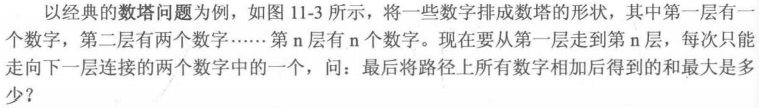

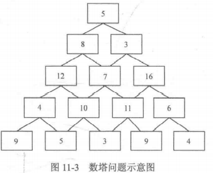

令dp[i] [j]表示从第i行第j个数字出发的到达最底层的所有路径中能得到的最大和。

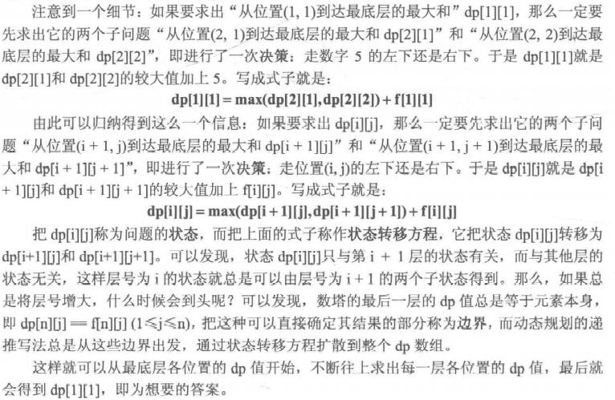

```cpp
#include <stdio.h>
#include <algorithm>
using namespace std;
const int maxn = 1000;
int f[maxn][maxn], dp[maxn][maxn];

int main(void)
{
    int n;
    scanf("%d", &n);
    for(int i = 1; i <= n; i++)
    {
        for(int j = 1; j <= i; j++)
        {
            scanf("%d", &f[i][j]);  //输入数塔
        }
    }
    
    //边界
    for(int j = 1; j <= n; j++)
    {
        dp[n][j] = f[n][j];
    }
    
    //从n-1层不断往上计算出dp[i][j]
    for(int i = n-1; i >= 1; i--)
    {
        for(int j = 1; j <= i; j++)
            //状态转移方程
            dp[i][j] = max(dp[i + 1][j], dp[i + 1][j + 1]) + f[i][j];
    }
    
    printf("%d", dp[1][1]);
    return 0;
}
```

**使用递推写法的计算方式是自底向上，即从边界开始，不断向上解决问题，直到解决了目标问题；而使用递归写法的计算方式是自顶向下，即从目标问题开始，将它分解成子问题的组合，直到分解至边界为止。**

如果一个问题的最优解可以由其子问题的最优解有效地构造出来，那么称这个问题拥有最优子结构。一个问题必须拥有重叠子问题和最优子结构，才能使用动态规划去解决。

### 最大连续子序列和

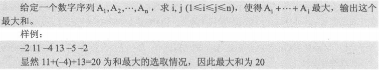

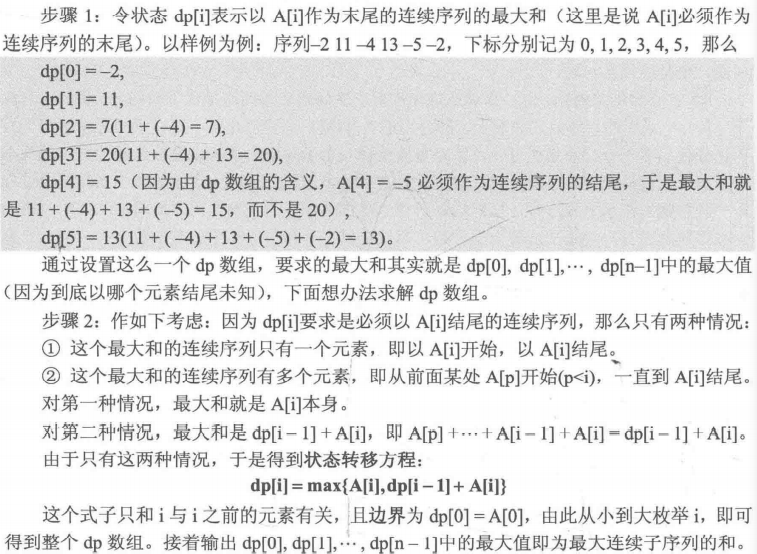

```cpp
#include <stdio.h>
#include <algorithm>
using namespace std;

const int maxn = 10010;
int A[maxn], dp[maxn];  //A[i]存放序列，dp[i]存放以A[i]结尾的连续序列的最大和
int main(void)
{
    int n;
    scanf("%d", &n);
    
    for(int i = 0; i < n; i++)
        scanf("%d", &A[i]);  //读入序列
    
    //边界
    dp[0] = A[0];
    
    for(int i = 1; i < n; i++)
        //状态转移方程
        dp[i] = max(A[i], A[i] + dp[i - 1]);
    
    //dp[i]存放以A[i]结尾的连续序列的最大和，需要遍历i得到最大的才是结果
    int k = 0;
    for(int i = 1; i < n; i++)
    {
        if(dp[i] > dp[k])
            k = i;
    }
    
    printf("%d", dp[k]);
}
```

**状态的无后效性**是指：当前状态记录了历史信息，一旦当前状态确定，就不会再改变，且未来的决策只能在已有的一个或若干个状态的基础上进行，历史信息只能通过已有的状态去影响未来的决策。针对本节的问题来说，每次计算状态dp[i]，都只会涉及dp[i - 1]，而不直接用到dp[i - 1]蕴含的历史信息。

对动态规划来说，必须设计一个拥有无后效性的状态以及相应的状态转移方程（核心）。

### 最长不下降子序列（LIS）

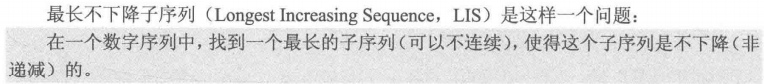

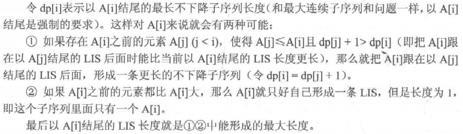

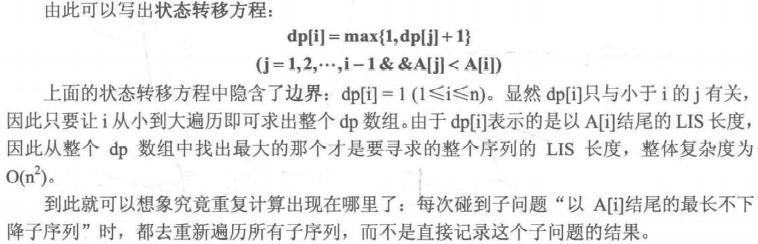

```cpp
#include <stdio.h>
#include <algorithm>
using namespace std;
const int N = 100;
int A[N], sp[N];
int main(void)
{
    int n;
    scanf("%d", &n);
    for(int i = 1; i <= n; i++)
    {
        scanf("%d", A[i]);
    }
    
    ans = -1;  //记录最大的dp[i]
    for(int i = 1; i <= n; i++)  //按顺序计算出dp[i]的值
    {
        dp[i] = 1;  //边界初始条件（即先假设每个元素自成一个序列）
        for(int j = 1; j < i; j++)
            if(A[j] <= A[i] && dp[j] + 1 > dp[i])
                dp[i] = dp[j] + 1;  //状态转移方程，用以更新dp[i]
        
        ans = max(ans, dp[i]);
    }
    
    printf("%d", ans);
    return 0;
}
```


### 最长公共子序列（LCS）

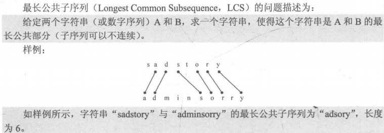

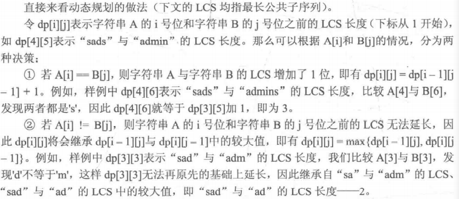

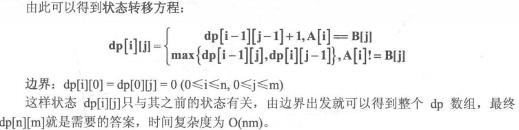

在每一步中，要么i自增1，要么j自增1

```cpp
#include <stdio.h>
#include <string.h>
#include <algorithm>
using namespace std;
const int N = 100;
char A[N], B[N];
int dp[N][N];

int main(void)
{
    scanf("%s", A + 1);  //从下标为1开始读入
    scanf("%s", B + 1);
    int lenA = strlen(A + 1);  //由于读入时下标从1开始，因此读取长度也从1开始
    int lenB = strlen(B + 1);
    
    //边界
    for(int i = 0; i <= lenA; i++)
        dp[i][0] = 0;
    for(int i = 0; i <= lenB; i++)
        dp[0][i] = 0;
    
    //状态转移方程
    for(int i = 1; i <= lenA; i++)
    {
        for(int j =1; j <= lenB; j++)
        {
            if(A[i] == B[j])
                dp[i][j] = dp[i-1][j-1] + 1;
            else
                dp[i][j] = max(dp[i - 1][j], dp[i][j - 1]);
        }
    }
    
    printf("%d", dp[lenA][lenB]);
    return 0;
}

```

以上的做法的时间复杂度为n^2^，以下做法的复杂度为nlogn


将原来的dp数组的存储由数值换成**该序列中，上升子序列长度为i的上升子序列，的最小末尾数值**


这其实就是一种几近贪心的思想：我们当前的上升子序列长度如果已经确定，那么**如果这种长度的子序列的结尾元素越小，后面的元素就可以更方便地加入到这条我们臆测的、可作为结果、的上升子序列中。**

该代码求的是最长上升子序列

```cpp
int n;  //点的个数
cin >> n;

for(int i = 1; i <= n; i++)
{
    cin >> a[i];
    f[i] = 0x3fffffff;  //初始值可以设置为INF，也可以不这样设置，因为在下面对f[]的二分查找中也不会越界查找
}

f[1] = a[1];
int len = 1;  //len既是序列的最长长度，也作为下标指向当前最长序列的最末尾元素
/*因为上文中所提到我们有可能要不断向前寻找，
	所以可以采用二分查找的策略，这便是将时间复杂
    度降成nlogn级别的关键因素。*/ 

for(int i = 2; i <= n; i++)
{
    int l = 1, r = len, mid;
    if(a[i] > f[len])  //如果刚好大于末尾，暂时向后顺次填充
        f[++len] = a[i];
    else
    {
        while(l < r)
        {
            mid = (l + r) / 2;
            
            if(f[mid] > a[i])
                r = mid;
            else
                l = mid + 1;
        }
        f[l] = a[i]; //min(a[i], f[l])
    }
}
```

由于求取的最长上升子序列，在二分查找中找的是从前往后数的第一个大于`a[i]`的元素的位置，其前面的元素必定小于`a[i]`，同时可以得出`f[]`数组中的元素是递增排列的。

在上面还可以加一个判断，如果`f[len] == a[i]`，就不用再去查找了。

寻找在序列中第一个大于`a[i]`的元素，因为前一个元素小于`a[i]`，后一个元素大于`a[i]`，所以接在前一个元素的后面，序列长度增1，替换掉后一个元素。

由于`upper_bound()`和`lower_bound()`使用的就是二分查找，因此可以用这两个函数来替代二分查找部分的代码


**注意：**在dp数组中的元素不是按照在i长度序列中的顺序排列的，即`dp[i]`为i长度的序列的末尾元素，但是`dp[i-1]`不是长度为i的序列的倒数第二个元素。

#### P1439

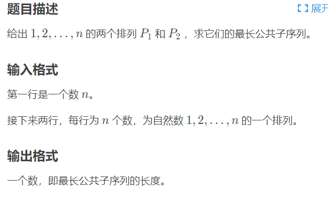

```markdown
输入
5 
3 2 1 4 5
1 2 3 4 5

输出
3
```

```cpp
/*
* 此题不能用直接的最长公共子序列来求解，会卡n方算法
* 
* 注意到这个序列是一个全排列，即每一个数都是不同的，因此使用散列
* 将第一个序列中的数字映射为顺序的1-n，即对应的值为顺序递增的形式
* 这样两者的公共序列映射成的序列也将是按递增的顺序排列，这样就可以将
* 公共子序列问题转化为最长上升子序列问题
*/

#include <iostream>
#include <algorithm>
using namespace std;

const int maxn = 100005;

int n; //n个数
int a[maxn]; //第一个序列
int b[maxn];  //第二个序列
int map[maxn];  //映射

int dp[maxn]; //dp[i]表示长度为i的上升子序列的末尾元素值

int main()
{
	//输入数据
	cin >> n;

	for (int i = 1; i <= n; i++)
	{
		cin >> a[i];
		map[a[i]] = i;
	}

	for (int i = 1; i <= n; i++)
	{
		cin >> b[i];
	}

	dp[1] = map[b[1]];
	int len = 1; //上升序列的最长长度

	for (int i = 2; i <= n; i++)
	{
		int l = 1, r = len, mid;
		if (map[b[i]] > dp[len])
		{
			dp[++len] = map[b[i]];
		}
		else
		{
			while (l != r)
			{
				mid = (l + r) / 2;
				if (dp[mid] > map[b[i]])
					r = mid;
				else
				{
					l = mid + 1;
				}
			}
			dp[l] = map[b[i]];
		}
	}

	cout << len;
}
```


```cpp
/*
* 此题不能用直接的最长公共子序列来求解，会卡n方算法
* 
* 注意到这个序列是一个全排列，即每一个数都是不同的，因此使用散列
* 将第一个序列中的数字映射为顺序的1-n，即对应的值为顺序递增的形式
* 这样两者的公共序列映射成的序列也将是按递增的顺序排列，这样就可以将
* 公共子序列问题转化为最长上升子序列问题
*/

#include <iostream>
#include <algorithm>
using namespace std;

const int maxn = 100005;

int n; //n个数
int a[maxn]; //第一个序列
int b[maxn];  //第二个序列
int map[maxn];  //映射

int dp[maxn]; //dp[i]表示长度为i的上升子序列的末尾元素值

int main()
{
	//输入数据
	cin >> n;

	for (int i = 1; i <= n; i++)
	{
		cin >> a[i];
		map[a[i]] = i;
	}

	for (int i = 1; i <= n; i++)
	{
		cin >> b[i];
	}

	dp[1] = map[b[1]];
	int len = 1; //上升序列的最长长度

	for (int i = 2; i <= n; i++)
	{
		int v = map[b[i]];
		if (v > dp[len])
		{
			dp[++len] = map[b[i]];
		}
		else
		{
			//在dp[]中第一个大于map[b[i]]的元素的位置
			int ptr = upper_bound(dp + 1, dp + len + 1, map[b[i]]) - dp;
			dp[ptr] = map[b[i]];
		}
	}

	cout << len;
}
```


####P1020

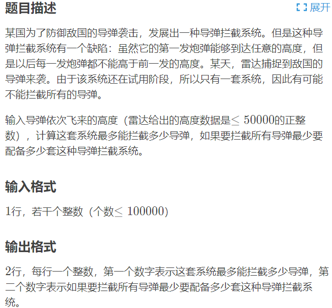

```markdown
输入
389 207 155 300 299 170 158 65
    
输出
6
2
```


```cpp
/*
* “以后每一发炮弹都不能高于前一发的高度”说明这是一个最长不上升子序列问题
* 
* “拦截所有导弹需要配备多少套这样的系统”是一个最长上升子序列问题，
* 可以这样来联想：dp2[]数组的下标代表了系统的编号（从1开始），对
* dp2[]数组的元素覆盖（在数组中寻找第一个大于新导弹高度的元素然后覆盖）
* 的意义是从该编号的系统来打该新导弹，然后该编号的系统能打击的高度就
* 只能是新导弹的高度了。在数组中增加元素（len2++），是因为新导弹的
* 高度大于目前所有系统能打击的最大高度，所以必须配备新系统。
* 
* 在覆盖时其实是一种贪心的思想，新导弹必须有系统来打，选择目前能打的且打击
* 高度值最小的系统来打，留着打击高度值较大的系统来打击未知的高度值可能更大的
* 导弹，保证每次都取最优
* 
*/


#include <iostream>
#include <algorithm>
using namespace std;

const int maxn = 100005;

int a[maxn];  //导弹的高度值

//最长不上升子序列
int len1;  //序列长度
int dp1[maxn];  //dp1[i]表示长度为i的序列的末尾元素

//最长上升子序列
int len2;  //序列长度
int dp2[maxn]; //dp2[i]表示长度为i的序列的末尾元素

int main(void)
{
	//输入导弹的高度值
	int x;
	int n = 0;
	while (cin >> x)
	{
		a[++n] = x;
	}

	//初始化
	dp1[1] = dp2[1] = a[1];
	len1 = len2 = 1;

	int ptr;
	for (int i = 2; i <= n; i++)
	{
		//最长不上升子序列
		if (a[i] <= dp1[len1])
		{
			dp1[++len1] = a[i];
		}
		else
		{
			//等于是可以继续接在后面的，寻找一个小于的位置
			ptr = upper_bound(dp1 + 1, dp1 + 1 + len1, a[i], greater<int>()) - dp1;
			dp1[ptr] = a[i];

		}

		//最长上升子序列
		if (a[i] > dp2[len2])
		{
			dp2[++len2] = a[i];
		}
		else
		{
			//寻找第一个大于等于的元素的位置
			ptr = lower_bound(dp2 + 1, dp2 + 1 + len2, a[i]) - dp2;
			dp2[ptr] = a[i];
		}
	}
	cout << len1 << endl << len2;
}
```


### 最长回文子串

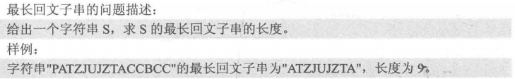

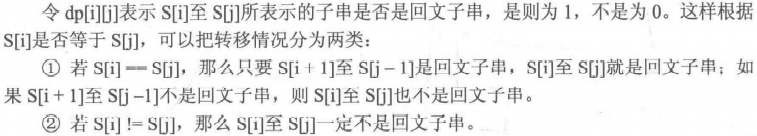

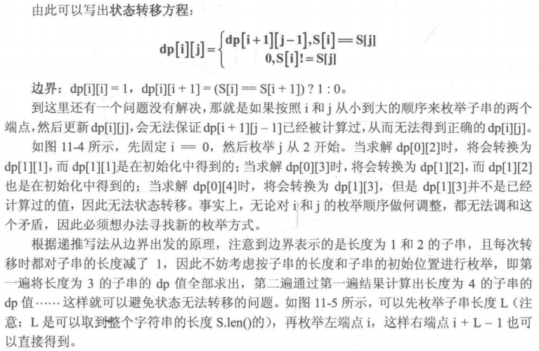

```cpp
#include <stdio.h>
#include <string.h>
const int maxn = 1010;
char S[maxn];
int dp[maxn][maxn];
int ans = 1;

int main()
{
    scanf("%s", S)
    int len = strlen(S);
    fill(dp[0], dp[0] + maxn * maxn, 0);  //dp数组初始化为0，这样根据条件是否更改为1
    
    //边界
    for(int i = 0; i < len; i++)
    {
        dp[i][i] = 1;
        if(i < len - 1)
        {
            if(S[i] == S[i + 1])
            {
                dp[i][i + 1] = 1;
                ans = 2;  //初始化时注意当前最长回文子串长度
            }
        }
    }
    
    //状态转移方程
    for(int L = 3; L <= len; L++)  //枚举子串的长度
    {
        for(int i = 0; i + L - 1 < len; i++) //枚举子串的起始端点
        {
            int j = i + L -1;  //子串的右端点
            if(S[i] == S[j] && dp[i + 1][j - 1] == 1)
            {
                ans = L;  //更新最长回文子串长度
             	dp[i][j] = 1;   
            }
        }
    }
    
    printf("%d\n", ans);
    return 0;
    
}

```


### 区间动态规划


#### 概念

顾名思义，就是动态规划过程中求一个区间的最优解。通过将一个大的区间分为很多个小的区间，求其小区间的解，然后一个一个的组合成一个大的区间而得出最终解，**有没有发现，这完全就是分治的思想。**

#### 步骤

1.状态：用dp[i][j]表示区间(i,j)的最优解

2.状态转移：

```markdown
    最常见的写法：     dp[i][j]=max/min(dp[i][j],dp[i][k]+dp[k+1][j]+something)

    理解：区间（i，j）的最优解就等于 区间（i,j）   同 (i,k)和区间（k+1,j）合并后的值   比谁更优。
```

3.初始化：           `dp[i][i]=0/other  (i=1->n)`

 为什么这么做呢？很好理解，就是只包含自己本身的时候，也就是区间长度为1，值肯定是确定的。


#### 写法

第一种

```cpp
//区间长度为1的情况已经初始化了，在以下中区间的长度最小为2，即(r - l + 1) >= 2
for(int r = 2; r <= n; r++)
{
    for(int l = r - 1; l >= 1; l--)
    {
        for(int k = l; k < r; k++)
        {
            dp[l][r] = max/min(dp[l][r], dp[l][k] + dp[k + 1][r] + something);
        }
    }
}
```

第二种

```cpp
for(int len = 2; len <= n; len++)//len为区间长度，l和r分别为区间端点
{
    for(int l = 1; i + len - 1 <= n; l++)
    {
        int r = l + len - 1;
        for(int k = l; k < r; k++)
        {
            dp[l][r] = max/min(dp[l][r], dp[l][k] + dp[k+1][r] + something);
        }
    }
}
```


第一种是个人比较喜欢也是很容易想到的。理解起来很简单：遍历以r为终点，从1到r的所有子区间。

这种做法的一个好处就是dp[l][r]存的一定是r为右区间的每一步的最优解。

第二种是用的人数最多的。 理解：从区间长度为2--n，每次遍历固定长度的区间。比如，len=2时，遍历（1,2）（2,3）..（n-1,n）。这样也能遍历完所有的情况。


#### P1880

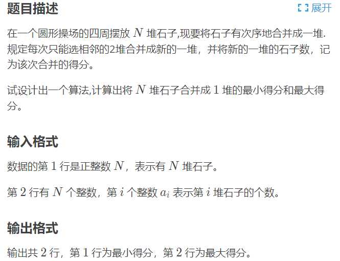

```markdown
输入
4
4 5 9 4

输出
43
54
```


```cpp
/*
* 由于这里为圆形操场上摆放的石子，即环形区间，我们将数组大小开到两倍，
* 两个数组衔接着来模拟环形区间
*/

#include <iostream>
#include <algorithm>
using namespace std;

const int maxn = 205;
const int INF = 0x3fffffff;

int main()
{
	int N; //有N堆石子
	int arr[maxn]; //每一堆石子的个数
	int sum[maxn] = { 0 }; //sum[]中的元素全部为0
	//sum[i]表示arr[]中1~i这些元素的和
	//sum[j] - sum[i - 1]表示i~j区间内的石子数的总和

	int dp1[maxn][maxn] = { 0 }; //dp1[i][j]表示把第i堆到第j堆合并成1堆的最小得分
	int dp2[maxn][maxn] = { 0 }; //dp2[i][j]表示把第i堆到第j堆合并成1堆的最大得分
	//初始化为0，表示一堆时不用合并，得分为0

	//输入并整理数据
	cin >> N;
	for (int i = 1; i <= N; i++)
	{
		cin >> arr[i];
		arr[i + N] = arr[i];
	}

	for (int i = 1; i <= 2 * N; i++)
		sum[i] = sum[i - 1] + arr[i];

	//递推
	for (int len = 2; len <= N; len++)
	{
		for (int l = 1; l + len - 1 <= 2 * N; l++)
		{
			int r = l + len - 1;
			dp1[l][r] = INF;
			dp2[l][r] = 0;
			for (int k = l; k < r; k++)
			{
				dp1[l][r] = min(dp1[l][r], dp1[l][k] + dp1[k + 1][r]);
				/*
				* 上式的意义：在合并l~r堆前，l~k堆已经合并为1堆了，k+1~r已经合并为
				* 一堆了，此时只要把这两堆合并为一堆就好
				*/
				dp2[l][r] = max(dp2[l][r], dp2[l][k] + dp2[k + 1][r]);
			}
			dp1[l][r] += sum[r] - sum[l - 1];
			dp2[l][r] += sum[r] - sum[l - 1];
		}
	}

	//遍历寻找答案
	int lowest_point = INF;
	int highest_point = 0;
	for (int i = 1; i + N - 1 <= 2 * N; i++)
	{
		lowest_point = min(lowest_point, dp1[i][i + N - 1]);
		highest_point = max(highest_point, dp2[i][i + N - 1]);
	}

	cout << lowest_point << endl << highest_point;
}
```


### DAG（有向无环图）最长路

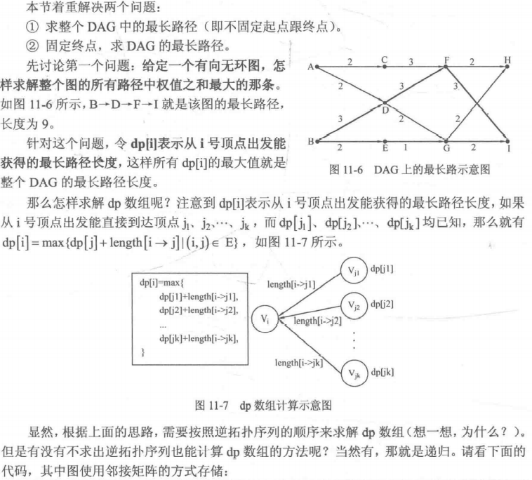

```cpp
int DP(int i)
{
    if(dp[i] > 0)  //dp[i]已计算得到
        return dp[i];
    for(int j = 0; j < n; j++)  //遍历i的所有出边
    {
        if(G[i][j] != INF)
            dp[i] = max(dp[i], DP[j] + G[i][j]);
    }
    return dp[i];  //返回计算完毕的dp[i]
}
```

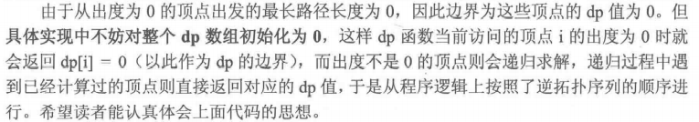

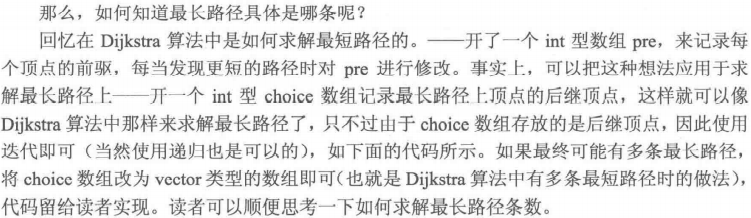

```cpp
int DP(int i)
{
    if(dp[i] > 0)  //dp[i]已计算得到
        return dp[i];
    
    for(int j = 0; j < n; j++)  //遍历i的所有出边
    {
        if(G[i][j] != INF)
        {
            int temp = DP(j) + G[i][j];  //单独计算，防止if中调用DP函数两次
            if(temp > dp[i])  //可以获得更长的路径
            {
                dp[i] = temp;  //覆盖dp[i]
                choice[i] = j;  //i的后继顶点是j
            }
        }
    }
    return dp[i];  //返回计算完毕的dp[i]
}

//调用printPath前需要先得到最大的dp[i]，然后将i作为路径起点传入
void printPath(int i)
{
    printf("%d", i);
    while(choice[i] != -1) //choice数组初始化为-1
    {
        i = choice[i];
        printf("->%d ", i);
    }
}
```

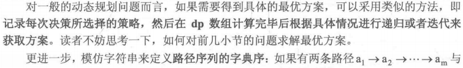

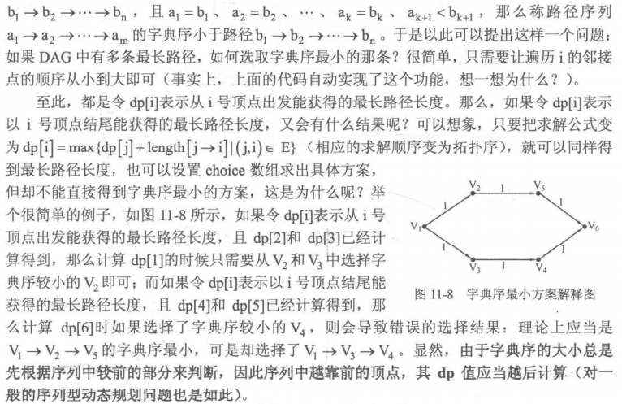

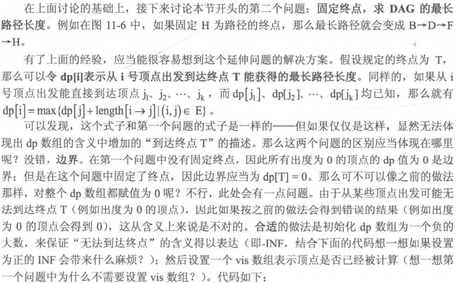

```cpp
int DP(int i)
{
    if(vis[i])  //dp[i]已计算得到
        return dp[i];
    
    vis[i] = true;
    
    for(int j = 0; j < n; j++)  //遍历i的所有出边
    {
        if(G[i][j] != INF)
        {
            dp[i] = max(dp[i], DP(j) + G[i][j]);
        }
    }
    
    return dp[i];  //返回计算完毕的dp[i]
}
```

**注：**所有顶点都有dp值，DP函数将返回该顶点的dp值，无法到达给定终点T的dp值为负数（设置为-INF的原因）。

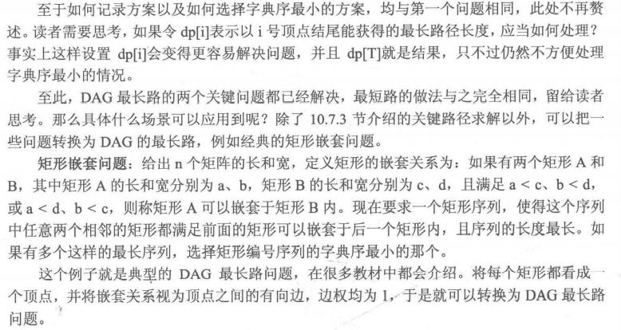

### 背包问题

#### 多阶段动态规划问题

有一类动态规划可解的问题，它可以描述成若干个有序的阶段，且每个阶段的状态只和上一个阶段的状态有关，一般把这类问题称为多阶段动态规划问题。

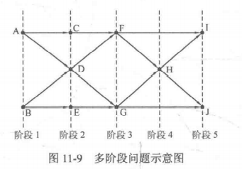

该问题被分为5个阶段，其中状态F属于阶段3，它由阶段2的状态C和D推得。

显然，对这种问题，只需要从第一个问题开始，按照阶段的顺序解决每个阶段中状态的计算，就可以得到最后一个阶段中的状态的解。

#### 01背包问题

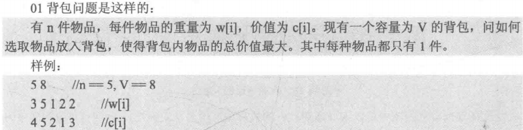

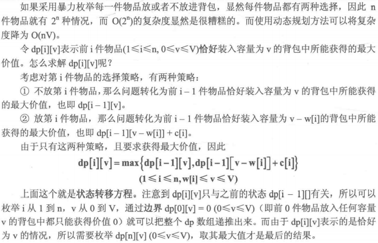

因此可以写出代码：

```cpp
for(int i = 1; i <= n; i++)
{
    for(int v = 0; v < w[i]; v++)
        dp[i][v] = dp[i-1][v];
    
    for(int v = w[i]; v <= V; v++)
        dp[i][v] = max(dp[i - 1][v], d[i - 1][v - w[i]] + c[i]);
}

```

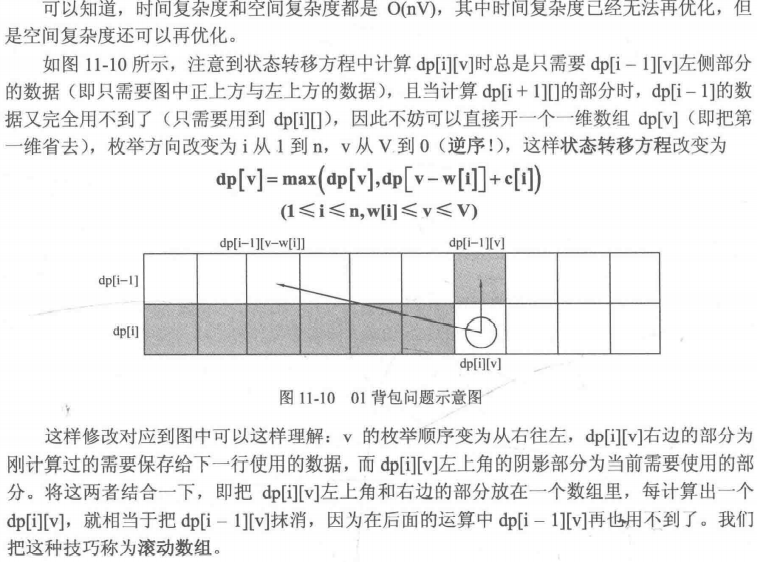

```cpp
for(int i = 1; i <= n; i++)
{
    for(int v = V; v >= w[i]; v--)  //逆序枚举v
        dp[v] = max(dp[v], dp[v - w[i]] + c[i]);
}
```

**特别说明：如果是用二维数组存放，v的枚举是顺序还是逆序都无所谓；如果使用一位数组存放，则v的枚举必须是逆序。**

```cpp
#include <stdio.h>
#include <algorithm>
using namespace std;
const int maxn = 100;
const int maxv = 100;
int w[maxn], c[maxn], dp[maxv];

int main(void)
{
    int n, V;
    scanf("%d %d", &n, &V);
    for(int i = 1; i <= n; i++)
        scanf("%d", &w[i]);
    
    for(int i = 1; i <= n; i++)
        scanf("%d", &c[i]);
    
    //边界
    for(int v = 0; v <= V; v++)
        dp[v] = 0;
    
    for(int i = 1; i <= n; i++)
    {
        for(int v = V; v >= w[i]; v--)
            //状态转移方程
            dp[v] = max(dp[v], dp[v - w[i]] + c[i]);
    }
    
    //寻找dp[0...V]中最大的即为答案
    int max = 0;
    for(int v = 0; v <= V; v++)
    {
        if(dp[v] > max)
            max = dp[v];
    }
    
    printf("%d", max);
    
    /*
    应该不用再遍历dp数组求取最大值，最大值就是dp[V]
    */
    
    return 0;
}
```

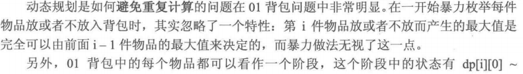

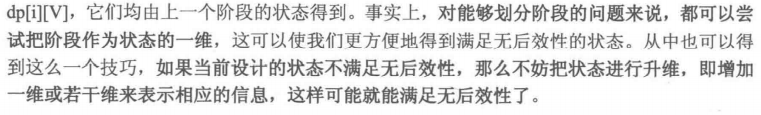

#### 完全背包问题

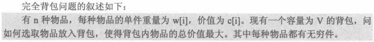


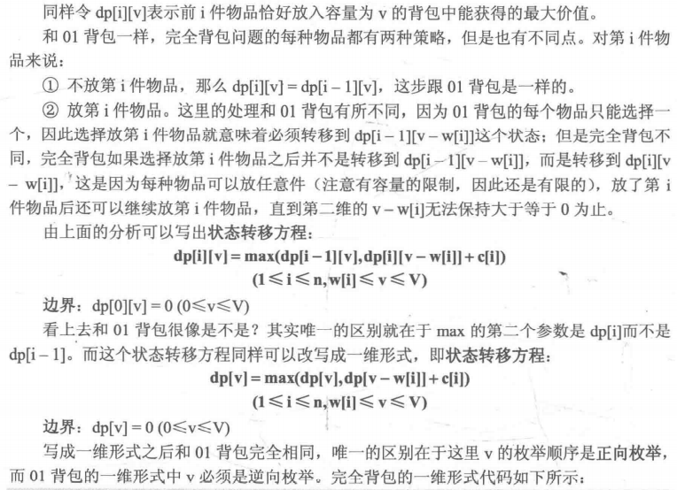

```cpp
for(int i = 1; i <= n; i++)
{
    for(int v = w[i]; v <= V; v++)  //正向枚举
        dp[v] = max(dp[v], dp[v - w[i]] + c[i]);
}
```

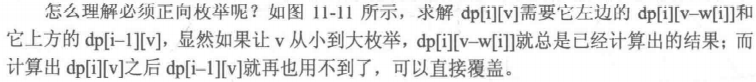

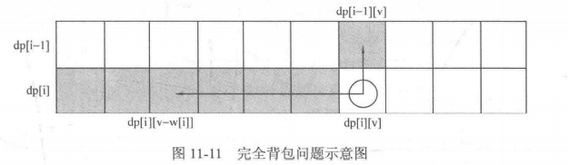


### 总结

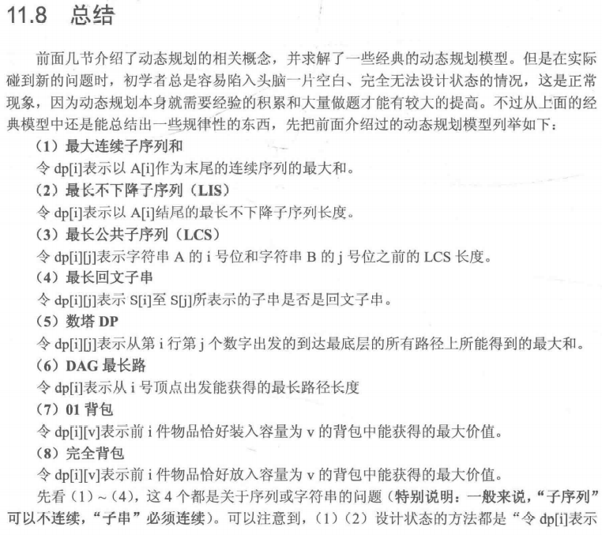

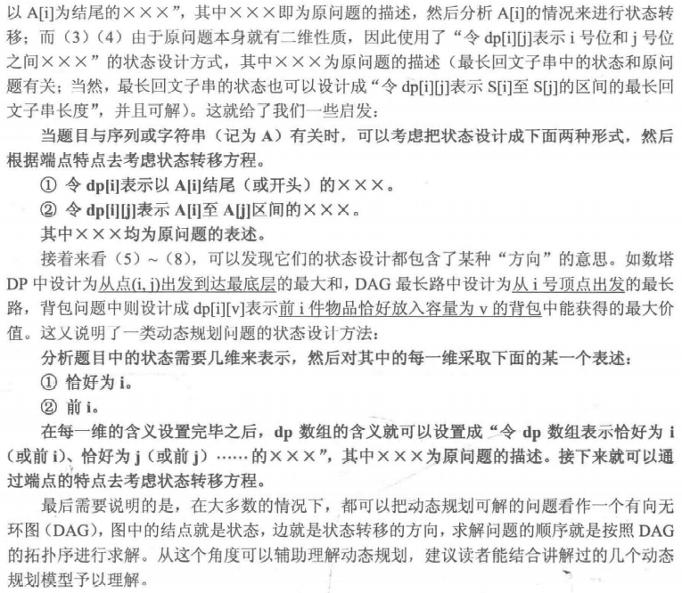


# 图论

### 

## 关键路径

关键路径是图中的最长路径，因此此处给出求解有向无环图（DAG）中最长路径的方法。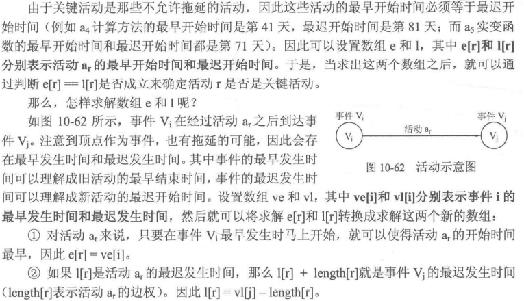

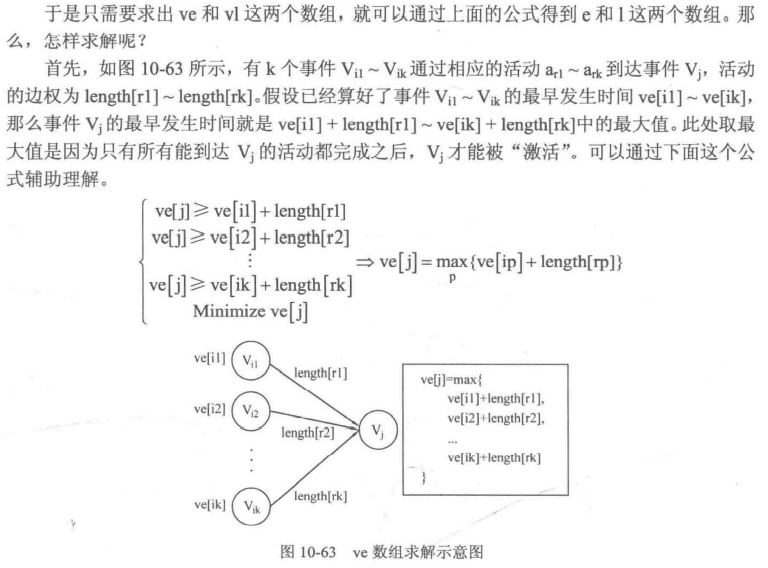

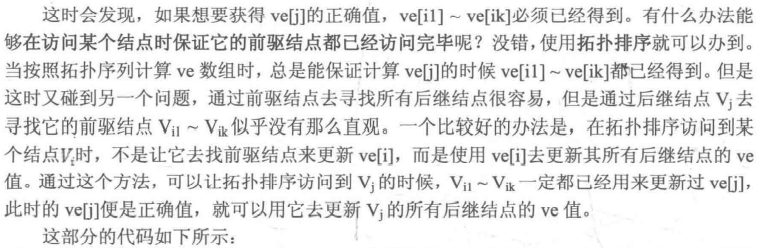

```cpp
//拓扑序列
stack<int> topOrder;

//拓扑排序，顺便求ve数组
bool topologicalSort()
{
    queue<int> q;
    for(int i = 0; i < n; i++)
    {
        if(inDegree[i] == 0)
        {
            q.push(i);
        }
    }
    
    while(!q.empty())
    {
        int u = q.front();
        q.pop();
        topOrder.push(u);  //将u加入拓扑序列（注意在出队的时候才加入拓扑序列）
        for(int i = 0; i < G[u].size(); i++)
        {
            int v = G[u][i].v;  //u的i号后继结点编号为v
            inDegree[v]--;
            //用ve[u]来更新u的所有后继结点v
            if(ve[u] + G[u][i].w > ve[v])
            {
                ve[v] = ve[u] + w;
            }
        }
    }
    
    if(topOrder.size() == n)
        return true;
    else
        return false;
}
```

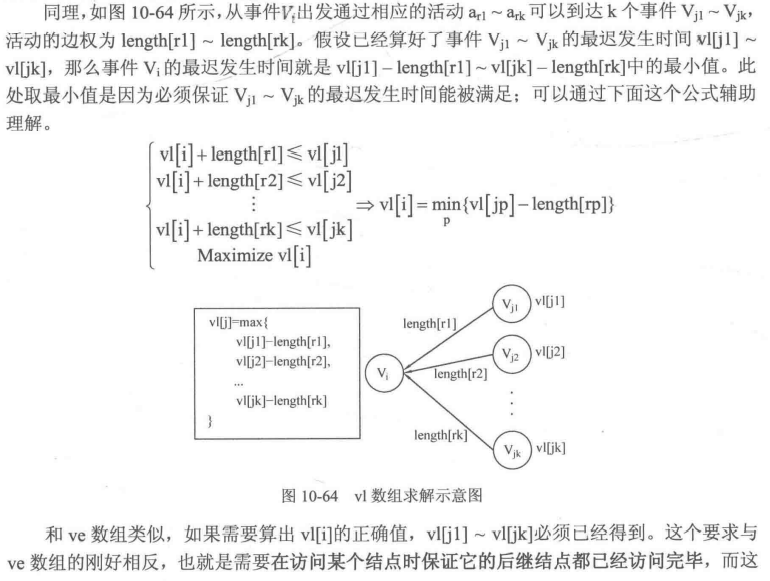


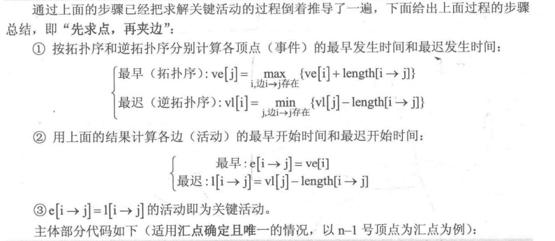

```cpp
//关键路径，不是有向无环图返回-1，否则返回关键路径长度
int CriticalPath()
{
    fill(ve, ve + n, 0);  //ve数组初始化
    if(topologicalSort() == false)
        return -1;
    
    fill(vl, vl + n, ve[n - 1]);  //vl数组初始化，初始值为汇点的ve值
    
    //直接使用topOrder出栈即为逆拓扑排序，求解vl数组
    while(!topOrder.empty())
    {
        int u = topOrder.top();  //栈顶元素为u
        topOrder.pop();
        
        for(int i = 0; i < G[u].size(); i++)
        {
            int v = G[u][i].v;  //u的后继结点v
            //用u的所有后继结点v的vl值来更新vl[u]
            if(vl[u] > vl[v] - G[u][i].w)
            {
                vl[u] = vl[v] - G[u][i].w;
            }
        }
    }
    
    //遍历邻接表的所有边，计算活动的最早开始时间e和最迟开始时间l
    for(int u = 0; u < n; u++)
    {
        for(int j = 0; j < G[u].size(); j++)
        {
            int v = G[u][j].v;
            int w = G[u][j].w;
            //活动的最早开始时间e和最迟开始时间l
            int e = ve[u], l = vl[v] - w;
            //如果e==l，说明活动u->v是关键活动
            if(e == l)
            {
                printf("%d->%d\n", u, v);  //输出关键活动
            }
        }
    }
    
    return ve[n - 1];  //返回关键路径长度
}
```

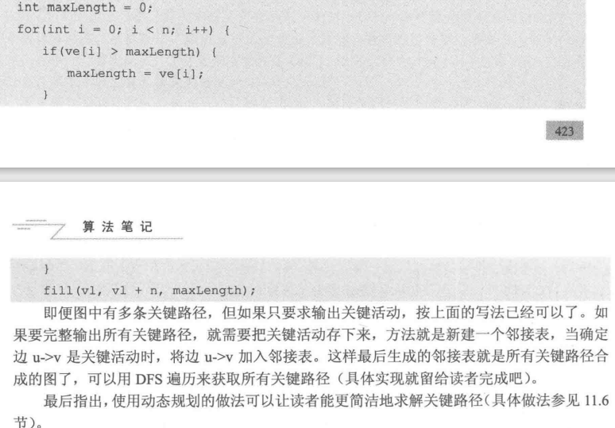


## 双向BFS搜索

* 双向bfs适用于知道起点和终点的状态下使用，从起点和终点两个方向开始进行搜索，可以非常大的提高单个bfs的搜索效率
* 实现是通过队列的方式，可以设置两个队列，一个队列保存从起点开始搜索的状态，另一个队列用来保存从终点开始搜索的状态，如果某一个状态下出现相交的情况，那么就出现了答案

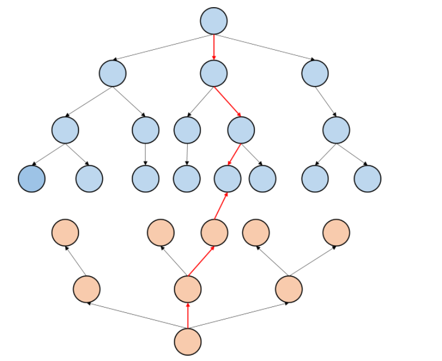

**注：**根据图，不是对多个状态同时判断是否相交，而是从某一方向搜索的某个状态出发，搜到了另一方向搜索的已有状态上。


### 题目1

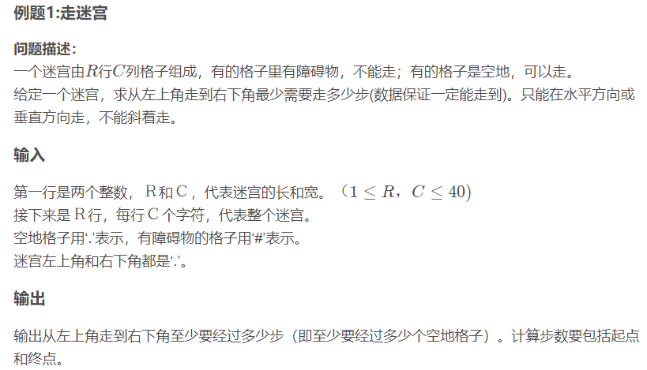

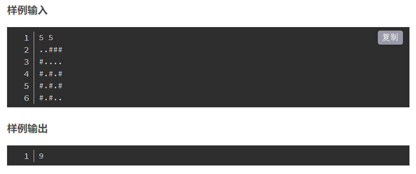

```cpp
5 5
..###
#....
#.#.#
#.#.#
#.#..
```

#### 策略分析

其实这道题是标准的bfs求最短路径，十分容易写出来，但是还是说一下双向bfs的思路，使用双向bfs一定要记录好两个队列的搜索状态，换句话说就是要知道当前这个点是由哪一个搜索树扩展过来的，首先一个起点一个终点，设置两个队列，同时开始搜索，如果搜索树相遇，就找到了解（由于这个题数据范围很小，所以bfs和双向bfs效率差不多

####单向bfs

```cpp
#include <iostream>
#include <cstring>
#include <queue>
using namespace std;
const int INF = 100000; 
const int MAX = 101;
typedef pair<int, int> P;
char map[MAX][MAX];
int d[MAX][MAX];//表示起点到各个位置的最短距离 
int sx, sy, gx, gy;//表示起点和终点坐标 
int n, m;
int dx[4] = {1, 0, -1, 0};
int dy[4] = {0, 1, 0,- 1};

bool Check(int x, int y) {
	if(x>=0 && x<n && y>=0 && y<m && d[x][y]==INF && map[x][y]!='#')
		return true;
	else return false;
} 

int bfs() {
	queue<P> que;
	for(int i = 0; i < n; i++)
		for(int j = 0; j < m; j++)
			d[i][j] = INF;	
	que.push(P(sx, sy));
	d[sx][sy] = 0;
	while(!que.empty()) {
		P p = que.front(); 
		que.pop();
		if(p.first == gx && p.second == gy)
			break;
		for(int i = 0; i < 4; i++) {
			int nx = p.first + dx[i];
			int ny = p.second + dy[i];
			if(Check(nx, ny)) {
				que.push(P(nx,ny));
				d[nx][ny] = d[p.first][p.second] + 1;
			}
		}
	}
	return d[gx][gy]; 
}

int main() {
	cin >> n >> m;
	for(int i = 0; i < n; i++)
		for(int j = 0; j < m; j++)
			cin >> map[i][j];
	sx = 0, sy = 0;
	gx = n-1, gy = m-1;
	int res = bfs(); 
	cout << res+1 << endl;
    return 0;
}

```


#### 双向bfs

```cpp
#include <iostream>
#include <queue>
#define P pair<int, int>
using namespace std;
//记录下当前状态, 从前往后搜索值为1，从后往前搜索值为2，如果某状态下，当前节点和准备扩展节点的状态相加为3，说明相遇
queue <P> q1, q2; 
int r, c, ans, dis[45][45], vst[45][45];
//dis数组表示从前搜或者从后搜到达该点的距离，第一次搜到该点的距离是最小的
//vst数组记录每个点被搜索的状态

int dx[4] = {-1, 0, 1, 0};
int dy[4] = {0, 1, 0, -1};
char m[45][45];

void dbfs() {
	bool flag;
	q1.push(P(1, 1)), dis[1][1] = 1, vst[1][1] = 1; //从前搜
	q2.push(P(r, c)), dis[r][c] = 1, vst[r][c] = 2; //从后搜
	while(!q1.empty() && !q2.empty()) {
		int x0, y0;
		if(q1.size() > q2.size()) { //每次扩展搜索树小的队列 flag=1扩展前搜的队列，flag=0扩展后搜的队列
			x0 = q2.front().first, y0 = q2.front().second;
			q2.pop();
			flag = 0;
		}else {
			x0 = q1.front().first, y0 = q1.front().second;
			q1.pop();
			flag = 1;
		}
		for(int i = 0; i < 4; i++) {
			int nx = x0 + dx[i];
			int ny = y0 + dy[i];
			if(nx >= 1 && nx <= r && ny >= 1 && ny <= c && m[nx][ny] == '.') {
				if(!dis[nx][ny]) {  //没有搜索过则更新dis和vst数组并加入队列
					dis[nx][ny] = dis[x0][y0] + 1;
					vst[nx][ny] = vst[x0][y0];
					if(flag) q1.push(P(nx, ny));
					else q2.push(P(nx, ny));
				}else {  //已经搜索过则判断两个点是否是两个状态的点
					if(vst[x0][y0] + vst[nx][ny]== 3) { //相遇
						ans = dis[nx][ny] + dis[x0][y0];
						return;
					}
				}
			}
		}
	}
}

int main() {
	cin >> r >> c;
	for(int i = 1; i <= r; i++)
		for(int j = 1; j <= c; j++)
			cin >> m[i][j];
	dbfs(); 
	cout << ans << "\n";
	return 0;
}


```


###题目2

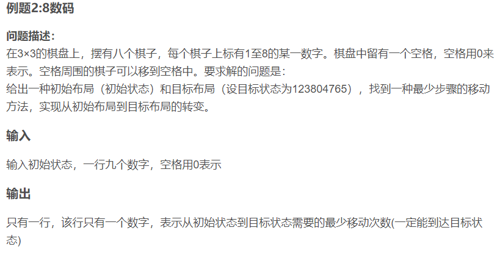

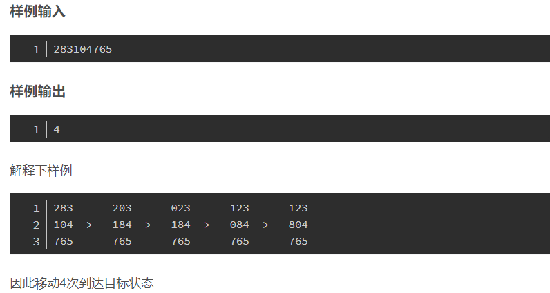


#### 策略分析

经典bfs题目，直接搜会很麻烦，中间会出现大量重复的状态，会浪费很多时间，因此为了去除重复状态，优化搜索效率，可以把这个三行转换成一个9位的整数。然后会发现这样转换后，每一种状态对应唯一的一个整数，因此队列中只需要保存整数（状态）即可，对于每一个整数都考虑是由哪一个整数转换得到的，同时相应步数加1，map会实现相同状态下的自动去重，十分方便，效率就会大大提升，但是在搜索的时候，还是需要转换回矩阵去判断0该往哪走。
提供单向bfs和双向bfs的思路
(单向bfs时间：31个测试点7962ms)
(双向bfs时间：31个测试点298ms)快了20多倍


####单向bfs

```cpp
#include <iostream>
#include <map>
#include <queue>
using namespace std;
const int END = 123804765;
map<int, int> dis;	//去重同时记录状态
int mat[3][3], n; 
int dx[4] = {-1, 0, 0, 1};
int dy[4] = {0, -1, 1, 0};
//用map去重
//对于每一个可能到达的状态用map记录，判断下一步方位的时候用矩阵判断，状态被转换成一个唯一数字表示 
void bfs(int s) {
	queue<int> q;
	q.push(s);
	dis[s] = 0;
	while(!q.empty()) {
		int t = q.front(), zx, zy;
		q.pop();
		int div = 100000000;
		if(t == END) return; //出现最终态可以结束搜索 

		for(int i = 0; i < 3; i++)  //当前t这种状态转换成mat矩阵 
			for(int j = 0; j < 3; j++) {
				mat[i][j] = (t / div) % 10;  //模10使得每次只取出最后一位数字
				div /= 10;
				if(!mat[i][j]) zx = i, zy = j;
			}	
		
		for(int i = 0; i < 4; i++) { //矩阵状态下扩展四个方向 
			int nx = zx + dx[i];
			int ny = zy + dy[i];
			if(nx >= 0 && nx < 3 && ny >= 0 && ny < 3) {
				swap(mat[zx][zy], mat[nx][ny]);
				int num = 0;
				for(int j = 0; j < 3; j++) //扩展后的矩阵，转换成数字，用来表示状态 
					for(int j1 = 0; j1 < 3; j1++) 
						num = num*10 + mat[j][j1];
							
				if(!dis.count(num)) { //如果当前这个状态没有出现过，那么可以由状态t一步转移过来 
					dis[num] = dis[t] + 1;
					q.push(num);
				}
				swap(mat[zx][zy], mat[nx][ny]);  //这一步很重要，扩展一次后一定要恢复，方便下一下扩展 
			}	
		}
	}
}

int main() {
	ios::sync_with_stdio(0);
	cin >> n;
	bfs(n);
	cout << dis[END] << "\n";
	return 0;
}

```

在队列中的点都是已经能得出状态（在此处状态和步数同时在dis数组中表示了）的。

#### 双向bfs

```cpp
#include <iostream>
#include <algorithm>
#include <queue> 
#include <map>
using namespace std;
const int end = 123804765;

map <int, int> state; //状态为1表示q1扩展的，状态为2表示q2扩展的 如果出现两个状态相加为3说明找到路径 
map <int, int> ans;
queue <int> q1, q2; //q1从前搜，q2从后搜 
int dx[4] = {-1, 0, 1, 0};
int dy[4] = {0, 1, 0, -1};
int cnt, mat[3][3], zx, zy;

inline int toInt() { //将数字转为矩阵
	int now = 0;
	for(int i = 0; i < 3; i++) 
		for(int j = 0; j < 3; j++)
			now = now * 10 + mat[i][j];
	return now;
}
inline void toMatrix(int s) { //将矩阵转为数字
	int div = 100000000;
	for(int i = 0; i < 3; i++)
		for(int j = 0; j < 3; j++) {
			mat[i][j] = (s / div) % 10;
			if(!mat[i][j]) zx = i, zy = j;
			div /= 10;
		}
}

void dbfs(int s) {
	if(s == end) return; 
	bool flag;
	state[s] = 1, state[end] = 2;
	ans[s] = 0, ans[end] = 1; 
	q1.push(s), q2.push(end);
	while(!q1.empty() && !q2.empty()) {
		flag = 0;
		int t;
		if(q1.size() > q2.size()) {
			t = q2.front(), q2.pop();
		}else {
			t = q1.front(), q1.pop();
			flag = 1;
		}
		toMatrix(t);
		for(int i = 0; i < 4; i++) {
			int num;
			int nx = dx[i] + zx;
			int ny = dy[i] + zy;
			if(nx >= 0 && nx < 3 && ny >= 0 && ny < 3) {
				swap(mat[zx][zy], mat[nx][ny]);
				num = toInt();
				if(!ans.count(num)) {  //当前状态未被扩展过
					ans[num] = ans[t] + 1;
					state[num] = state[t]; //更新状态
					if(flag) q1.push(num);
					else q2.push(num);
				}else if(state[t] + state[num] == 3){ //搜索范围重叠，出现答案 
					cnt = ans[t] + ans[num];
					return;
				}
				swap(mat[zx][zy], mat[nx][ny]);
			} 
		}
	}
}

int main() {
	int n;
	cin >> n;
	dbfs(n);	
	cout << cnt << "\n";
	return 0;
} 

```


## 最近公共祖先


###题目

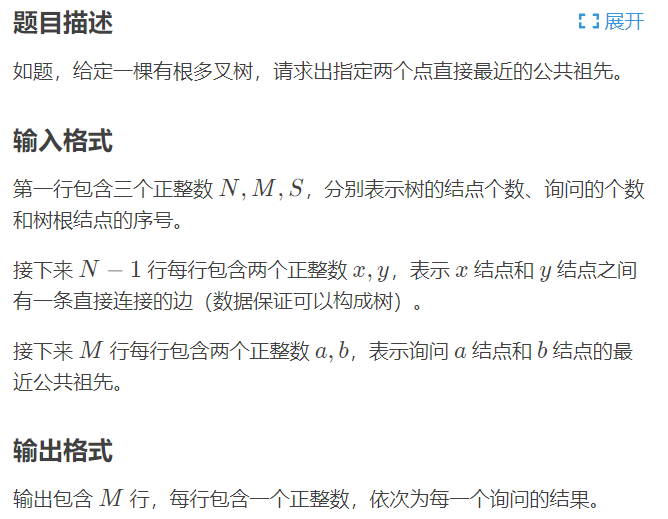

### 代码

```cpp
#include <iostream>

using namespace std;

const int maxn = 500005;

int f[maxn][21];  //f[i][j]表示i顶点的第2^j个父亲，没有则为0
int depth[maxn];  //表示每个结点的深度

int head[maxn], cnt = 0;

struct edge {
	int to;
	int next;
}e[maxn * 2];

void add(int u, int v)
{
	cnt++;
	e[cnt].to = v;
	e[cnt].next = head[u];
	head[u] = cnt;
}

//在dfs中建立depth和f数组
//传入参数为顶点及其父亲顶点的编号
void dfs(int u, int fa)
{
	//建立depth数组
	depth[u] = depth[fa] + 1;

	//建立f数组
	f[u][0] = fa;
	for (int i = 1; (1 << i) <= depth[u]; i++)
	{
		f[u][i] = f[f[u][i - 1]][i - 1];
	}

	//往下递归
	for (int i = head[u]; i; i = e[i].next)
	{
		int v = e[i].to;

		if (v == fa)  //防止回到父亲结点
			continue;

		dfs(v, u);
	}

}

int lca(int x, int y)
{
	//保证y的深度大于等于x的深度
	if (depth[x] > depth[y])
	{
		int temp = x;
		x = y;
		y = temp;
	}

	//y的深度不断减小，直到等于x的深度（一定能够等于）
	for (int i = 20; i >= 0; i--)
	{
		if (depth[x] <= depth[y] - (1 << i))
		{
			y = f[y][i];
		}
	}

	//如果两个结点相同了
	if (x == y)
		return x;

	//如果两个结点还没有相同，则需要以相同的步长回到祖先结点
	for (int i = 20; i >= 0; i--)
	{
		if (f[x][i] == f[y][i]) //回到的祖先结点不能相同
			continue;
		else
		{
			x = f[x][i];
			y = f[y][i];
		}
	}

	return f[x][0];
}

int main(void)
{
	int N, M, S; //结点个数、询问次数、树根结点的序号
	cin >> N >> M >> S;

	//输入边
	for (int i = 1; i < N; i++)
	{
		int u, v;
		cin >> u >> v;
		add(u, v);
		add(v, u);
	}

	//建立depth和f数组
	dfs(S, 0);

	int a, b;
	//返回查询的结果
	for (int i = 0; i < M; i++)
	{
		cin >> a >> b;
		cout << lca(a, b) << endl;
	}
}
```

### 补充解释

在dfs函数中，状态转移方程`f[u][i] = f[f[u][i - 1]][i - 1];`使用的是倍增策略（2的幂），所以只有当跳跃的步长大于等于2的时候才能进入for循环

`f[u][i-1]`在for循环前或每一次循环的前一次循环得出

由于是dfs，`f[u][i - 1]`将回到这条路径上之前经过的结点或者为0。每经过一个结点，其`f[该结点][...]`都将被确定，能回到某结点则非0，否则为0。

根结点的父结点设置为0，也是回不到的，所以在深度为2的时候就可以进入到for循环中了。

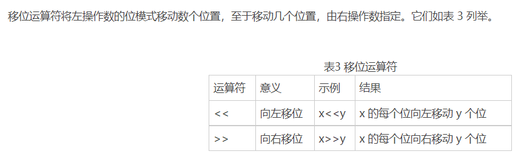


## tarjan算法


### 求强连通分量

####原理

tarjan算法利用dfs来搭建一棵搜索树，每一个强连通分量都是搜索树上的一棵子树，而整个图就是一棵完整的搜索树（由一个或多个强连通分量连接而成）

#### 算法流程

为了使这棵搜索树能够顺利求出强连通分量，我们需要给图上的每个点两个参数

1. dfn[]数组作为每个点搜索的次序编号（时间戳），也就是每个点被搜索到的顺序（注意每个点的时间戳都不一样）

2. low[]数组作为每个点在这棵搜索树中的最小的子树的根（也就是这个强连通分量中时间戳最小的那个点的时间戳），显然这个时间戳最小的点就是这个强连通分量子树的根结点，而这个根结点是随着搜索过程中low数组的更新而不断更新的，当我发现当前点的low更小，我就将当前点暂时作为根结点，最后更新出的真根结点还具有一个特点，也就是**dfn[x]==low[x]**

   ps：显然在搜索前，每个点能追溯到的最小时间戳就是自己，所以初始化也是dfn[x] = low[x]


#### 强连通分量的储存

为了储存强连通分量，我们要将其中的每个点都储存，这里挑选的容器是堆栈（栈中的所有点一定有父子关系），每次搜索到一个新结点，就入栈，如果这个点还有子结点，就继续搜索，当递归返回时，我们设子结点为v，当前结点为u，执行`low[u] = min(low[u], low[v])`，保证被更新的low数组始终为当前最小，同时，如果我们在搜索中遇到已经入栈的点，就需要换一种更新方式，`low[u] = min(low[u], dfn[v])`，因为若子结点已经入栈，就说明子结点的时间戳已经是我们当前递归所能搜索到的最早的时间戳了，继续搜索只会无限循环，此时应该更新当前结点的low值，并返回递归去更新父结点的low值


由于初始化时`dfn[x] = low[x] = ++ind;`，所以两种更新方式都可以是`low[u] = min(low[u], low[v])`


#### 代码

```cpp
void tarjan(int x)
{
    sta[++top] = x;  //将x入栈
    dfn[x] = low[x] = ++ind;  //初始化low与dfn数组，index
    pd[x] = 1;  //表示x已经入栈
    
    for(int i = 0; i < g[x].size(); i++) //遍历邻接表
    {
        int v = g[x][i];  //v是x的一个子结点
        if(!dfn[v])  //如果子结点尚未被搜索过
        {
            tarjan(v);  //进行搜索
            low[x] = min(low[x], low[v]);  //更新low，横插边，叶子结点的父结点选择x，环选择v
        }
        else if(pd[v])  //如果子结点已经入栈，此时构成一个环；如果不在栈中，说明子结点已经自己构成一个连通分量了
        {
            low[x] = min(low[x], dfn[v]);  //更新low，当有多个后向边时，选择时间戳最小的
        }
    }
    
    /*
    遍历到出度为0的结点时，中间的for循环代码不执行，该结点自己构成一个连通分量，之后该结点出栈
    */
    
    if(dfn[x] == low[x])  //x为该强连通块的根
    {
        tot++;  //tot为强连通分量的编号
        while(sta[top + 1] != x) //根x还未出栈
        {
            col[sta[top]] = tot;  //将当前栈顶元素标记，col[i]表示结点i所在连通分量的编号
            pd[sta[top--]] = 0;  //将栈顶元素出栈
        }
    }
}
```


### 缩点

强连通分量的没两个点都是强连通的，当我们遍历到强连通分量的任意一个点时，我们都可以以这个点为起始点来遍历整个强连通分量，从而我们可以将一个强连通分量看成一个超级点，这在处理点权/边权时非常使用

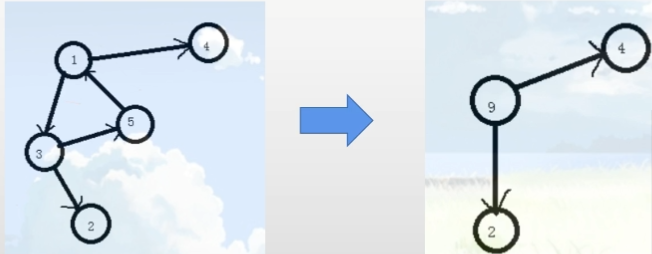

#### 代码

```cpp
for(int i = 1; i <= n; i++)
{
    if(!dfn[i])
        tarjan(i);
}


void tarjan(int x)
{
    dfn[x] = low[x] = ++ind;
    sta[++top] = x;
    pd[x] = 1;
    
    for(int i = 0; i < g[x].size(); i++)
    {
        int v = g[x][i];
        
        if(!dfn[v])
        {
            tarjan(v);
            low[x] = min(low[x], low[v]);
        }
        else if(pd[v]) //判断是否在栈中
            low[x] = min(low[x], dfn[v]);
        	//上面这句代码换成low[x] = min(low[x], low[v])也可
        /*
        原因就是下面在notibility中画的图，使用第一句代码时上下两个环的low值不同，但由于结点都在栈中，最后的col值是相同的，所以最终结果不影响。
        */
    }
    
    if(dfn[x] == low[x])
    {
        tot++;
        while(sta[top + 1] != x)
        {
            col[sta[top]] = tot;
            sum[tot] += val[sta[top]];  //将栈中所有点的权值累加
            pd[sta[top--]] = 0;
        }
    }
}
```

缩完点后记得重新建图

```cpp
memset(g, 0, sizeof(g));
//遍历每一条边
for(int i = 1; i <= m; i++)
{
    if(col[x[i]] != col[y[i]])  //该边的起点和终点不在同一个连通块
    {
        g[col[x[i]]].push_back(col[y[i]]);
    }
}
```


### 求割点

对于根节点，判断是不是割点很简单——计算其子树数量，如果有2棵即以上的子树，就是割点。因为如果去掉这个点，这两棵子树就不能互相到达。

对于非根节点，判断是不是割点就有些麻烦了。我们维护两个数组dfn[]和low[]，dfn[u]表示顶点u第几个被（首次）访问，low[u]表示顶点u及其子树中的点，通过非父子边（回边），能够回溯到的最早的点（dfn最小）的dfn值（但不能通过连接u与其父节点的边）。对于边(u, v)，如果low[v]>=dfn[u]，此时u就是割点。

但这里也出现一个问题：怎么计算low[u]。

假设当前顶点为u，则默认low[u]=dfn[u]，即最早只能回溯到自身。

有一条边(u, v)，如果v未访问过，继续DFS，DFS完之后，`low[u]=min(low[u], low[v])`，当v为叶子结点时，选择`low[u]`，当在环中递归返回时，选择`low[v]`；

如果v访问过（且u不是v的父亲），就不需要继续DFS了，一定有dfn[v]<dfn[u]，`low[u]=min(low[u], dfn[v])`（有多条回边到达不同的访问过的结点，选择时间戳最小的）。

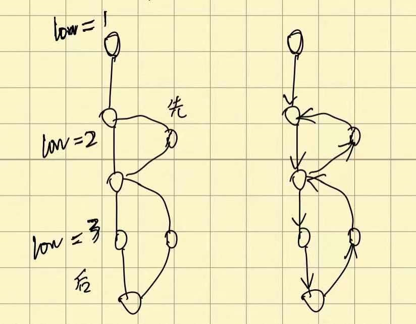

首先，为什么此处

### low[a]=min(low[a],dfn[p]);

不能写作

### low[a]=min(low[a],low[p]);

在我的理解，由于此处是一张无向图，我们有双向建了边，导致节点可以回溯到它的父节点；

而如果从它的父节点或其父节点的另一棵子树上有向上很多的返祖边，

这时把子节点的low值赋为父节点的low，就可能导致其low==其父节点low<其父节点dfn，

从而使本该是割点的点被忽视了，答案就少了，所以就wa了。

```cpp
#include <iostream>
#include <stdio.h>
#include <algorithm>
using namespace std;

const int maxn = 20002, maxm = 100004;

int n, m; //n个点，m条边

int head[maxn], cnt;
struct edge {
	int to;
	int next;
}e[2 * maxm];

void add(int u, int v)
{
	e[++cnt].to = v;
	e[cnt].next = head[u];
	head[u] = cnt;
}

int dfn[maxn], low[maxn], ind;
int is[maxn]; //判断i是否是割点

void tarjan(int u, int fa)
{
	dfn[u] = low[u] = ++ind;

	int children = 0;

	for (int i = head[u]; i; i = e[i].next)
	{
		int v = e[i].to;
		if (!dfn[v])
		{
			tarjan(v, u);
			low[u] = min(low[u], low[v]); //递归返回处理，分叉边，选择小的

			if (dfn[u] <= low[v] && u != fa)
			{
				is[u] = 1;
			}

			/*
			上面的dfn不能改为low，这样搜索树的第一层结点会被记录
			*/

			if (u == fa)
				children++;

			if (u == fa && children >= 2)
				is[u] = 1;

		}
		low[u] = min(low[u], dfn[v]);
	}
}

int main(void)
{
	cin >> n >> m;
	int x, y;
	for (int i = 1; i <= m; i++)
	{
		cin >> x >> y;
		add(x, y);
		add(y, x);
	}

	for (int i = 1; i <= n; i++)
	{
		if (!dfn[i])
			tarjan(i, i);
	}

	int tot = 0;

	for (int i = 1; i <= n; i++)
	{
		if (is[i])
			tot++;
	}

	cout << tot << endl;

	for (int i = 1; i <= n; i++)
	{
		if (is[i])
			cout << i << " ";
	}
}
```

**注：**如果是`low[u] = min(low[u], dfn[v])`，上方的环和下方的环的low值不相同，但在强连通分量的代码中，两个环的结点都会在栈中，所以不会出错。


#数


## 线段树

### 概念

注意，线段树的每个**节点**都对应一条**线段（区间）**，但并不保证所有的线段（区间）都是线段树的节点，这两者应当区分开。

如果有一个数组[1,2,3,4,5]，那么它对应的线段树大概长这个样子：

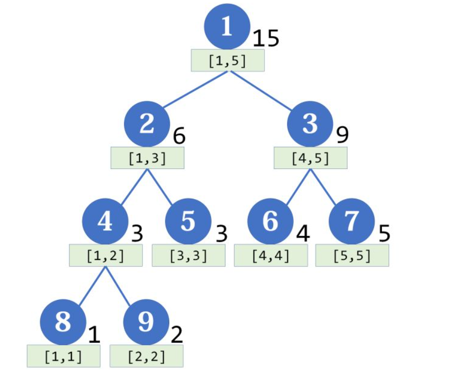

然后我们还可以得到一个性质：节点i的权值=她的左儿子权值+她的右儿子权值。因为1-4的和就是等于1-2的和2-3的和。


### 建立

根据线段树的概念，我们就可以建树了，设一个结构体数组`tree[]`

```cpp
struct t{
    int l, r;  //线段的左右下标
    int sum;  //线段的和
}tree[maxn];
```

```cpp
//i为当前结点的编号，l和r分别为该结点表示的区间的左端点和右端点
void build(int i, int l, int r) //递归建树
{
    tree[i].l = l;
    tree[i].r = r;
    if(l == r)  //如果这个结点是叶子结点
    {
        tree[i] = arr[i];  //都是i?
        return;
    }
    
    int mid = (l + r) / 2;
    //分别构造左子树和右子树
    build(2 * i, l, mid);
    build(2 * i + 1, mid + 1, r);
    tree[i].sum = tree[2 * i].sum + tree[2 * i + 1].sum;
    return;
    
}
```

## 简单（无pushdown）的线段树

### 区间查询

线段树的查询方法：

1. 如果这个区间被完全包括在目标区间里面，直接返回这个区间的值
2. 如果这个区间的左儿子和目标区间有交集，那么搜索左儿子
3. 如果这个区间的右儿子和目标区间有交集，那么搜索右儿子

**注：**在思考时以结点的区间为思考主体

```cpp
//i为结点编号
int search(int i, int l, int r)
{
    if(tree[i].l >= l && tree[i].r <= r)
        return tree[i].sum;
    
    if(tree[i].r < l || tree[i].l > r)
        return 0;
    
    int s = 0;
    if(tree[i * 2].r >= l)
        s += search(i * 2, l, r);
    if(tree[i * 2 + 1].l <= r)
        s += search(i * 2 + 1, l, r);
    return s;
}
```


### 单点修改

把区间的第dis位加上k

思路：

从根节点开始，看这个dis是在左儿子还是在右儿子，在哪往哪跑；

然后返回的时候，还是按照`tree[i].sum=tree[i*2].sum+tree[i*2+1].sum`的原则，更新所有路过的点

```cpp
//dis为区间中需要修改的点的编号，i为树中结点的编号，k为该点需要加上的值
void add(int dis, int i, int k)
{
    if(tree[i].l == tree[i].r) //如果是叶子结点，那么说明找到了
    {
        tree[i].sum += k;
        return;
    }
    
    if(dis <= tree[i * 2].r) //在哪往哪跑
        add(dis, i * 2, k);
    else
        add(dis, i * 2 + 1, k);
    
    tree[i].sum = tree[i * 2].sum + tree[i * 2 + 1].sum;  //返回更新
    return;
}
```

###上下分隔-----

### 区间修改

```cpp
void add(int i,int l,int r,int k)
{
    if(tree[i].r<=r && tree[i].l>=l)//如果当前区间被完全覆盖在目标区间里，讲这个区间的sum+k*(tree[i].r-tree[i].l+1)
    {
        tree[i].sum+=k*(tree[i].r-tree[i].l+1);
        tree[i].lz+=k;//记录lazytage
        return ;
    }
    push_down(i);//向下传递
    if(tree[i*2].r>=l)
        add(i*2,l,r,k);
    if(tree[i*2+1].l<=r)
        add(i*2+1,l,r,k);
    tree[i].sum=tree[i*2].sum+tree[i*2+1].sum;
    return ;
}
```

```cpp
void push_down(int i)
{
    if(tree[i].lz!=0)
    {
        tree[i*2].lz+=tree[i].lz;//左右儿子分别加上父亲的lz
        tree[i*2+1].lz+=tree[i].lz;
        int mid=(tree[i].l+tree[i].r)/2;
        tree[i*2].data+=tree[i].lz*(mid-tree[i*2].l+1);//左右分别求和加起来
        tree[i*2+1].data+=tree[i].lz*(tree[i*2+1].r-mid);
        tree[i].lz=0;//父亲lz归零
    }
    return ;
}
```

### 区间查询

```cpp
inline int search(int i,int l,int r){
    if(tree[i].l>=l && tree[i].r<=r)
        return tree[i].sum;
    if(tree[i].r<l || tree[i].l>r)  return 0;
    push_down(i);
    int s=0;
    if(tree[i*2].r>=l)  s+=search(i*2,l,r);
    if(tree[i*2+1].l<=r)  s+=search(i*2+1,l,r);
    return s;
}
```


### P3372

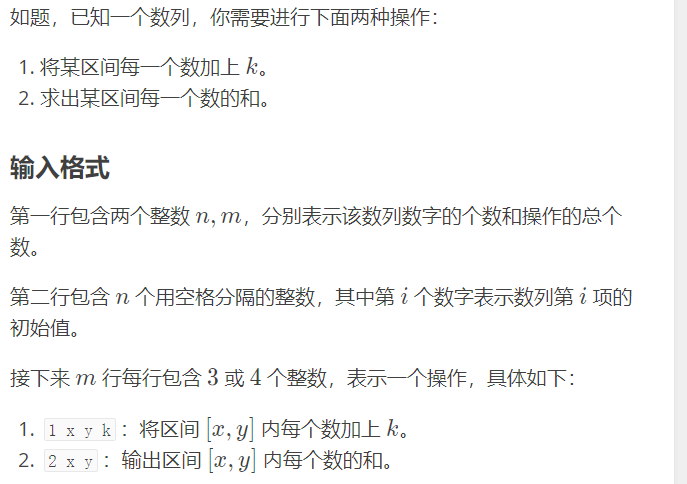

```cpp
/*
* 位运算
* 2 * p = p << 1
* 2 * p + 1 = p << 1 | 1
*/

#include <iostream>
using namespace std;

const int maxn = 100005;

int arr[maxn];  //保存数据的数组

struct node {
	int l, r;  //该结点维护的区间的左右端点
	long long num, tag;  //该区间的值，懒标记（该区间的每个数需要加上的数的值）
}t[maxn * 4 + 2];  //线段树数组的长度为4 * maxn即可

//建树函数，传入参数为线段树的结点在数组中的下标，区间的左右端点
void build(int p, int l, int r)
{
	t[p].l = l, t[p].r = r;
	t[p].tag = 0; //建树时每个结点的标记tag都为0
	if (l == r)  //到达叶子结点，给num赋值后直接返回
	{
		t[p].num = arr[l];
		return;
	}

	//非叶子结点，递归建立子树，递归返回后获得num值
	int mid = (l + r) >> 1;
	build(2 * p, l, mid);
	build(2 * p + 1, mid + 1, r);
	t[p].num = t[2 * p].num + t[2 * p + 1].num;
}

//下放标记的函数，传入参数为结点在线段树数组中的下标
void push_down(int p)
{
	if (t[p].tag)  //标记不为0时进行下放（这个判断其实是可以省略的，因为加上0原数不变）
	{
		//更新子结点的区间值及标记值，用的都是 +=
		t[2 * p + 1].num += (long long)t[p].tag * (t[2 * p + 1].r - t[2 * p + 1].l + 1);
		t[2 * p].num += (long long)t[p].tag * (t[2 * p].r - t[2 * p].l + 1);
		t[2 * p + 1].tag += t[p].tag;
		t[2 * p].tag += t[p].tag;

		//下放完毕，当前结点的tag标记值恢复为0
		t[p].tag = 0;
	}
}

//区间修改函数，传入参数为结点在数组中的下标（用来引出区间），需要修改的区间的左右端点，区间中每个数需要加上的数
void correct(int p, int l, int r, int k)
{
	if (l <= t[p].l && t[p].r <= r)  //如果当前区间包含在被修改区间内，则直接修改后（num和tag）返回
	{
		t[p].num += (long long)k * (t[p].r - t[p].l + 1);
		t[p].tag += k;
		return;
	}

	push_down(p);
	/*
	上面这个push_down一定需要，因为下面用t[p].num = t[2 * p].num + t[2 * p + 1].num来更新当前结点
	的num值，如果不push_down，则子结点的num值不是其所代表的区间的值，更新此结点的num值时会出错，则如果
	查询到此结点所代表的区间时就出错了
	*/

	//未完全包含，判断后递归进入子结点
	if (t[2 * p].r >= l)
		correct(2 * p, l, r, k);
	if (t[2 * p + 1].l <= r)
		correct(2 * p + 1, l, r, k);
	t[p].num = t[2 * p].num + t[2 * p + 1].num; //对子结点修改了，返回时修改当前结点的num值
}

//查询函数，传入参数为结点在数组中的下标，区间的左右端点值
long long query(int q, int l, int r)
{
	if (l <= t[q].l && t[q].r <= r)  //如果该结点表示的区间被包含在查询的区间中，则直接返回
		return t[q].num;

	//未完全包含，得下放标记，再查询子结点代表的区间
	push_down(q);

	long long ans = 0;
	if (t[q * 2].r >= l)
		ans += query(q * 2, l, r);
	if (t[q * 2 + 1].l <= r)
		ans += query(q * 2 + 1, l, r);
	return ans;
}

int main()
{
	int n, m; //数列数字的个数，操作的总个数
	cin >> n >> m;
	for (int i = 1; i <= n; i++)
	{
		cin >> arr[i];
	}

	build(1, 1, n);

	int op, x, y, k;
	for (int i = 1; i <= m; i++)
	{
		cin >> op;
		if (op == 1)
		{
			cin >> x >> y >> k;
			correct(1, x, y, k);
		}
		else if (op == 2)
		{
			cin >> x >> y;
			cout << query(1, x, y) << endl;
		}
	}
}
```

### P3375

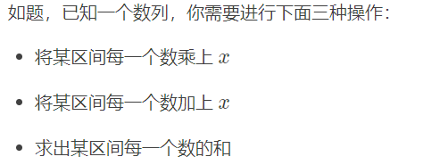

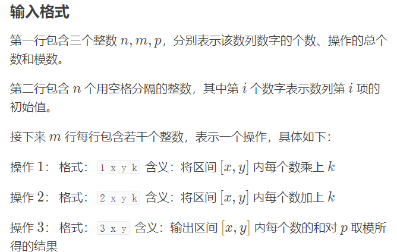

```cpp
#include <iostream>
using namespace std;

const int maxn = 100005;

int n, m;  //数列数字个数，操作的总个数、模数
long long p;
long long arr[maxn];

struct node {
	int l, r; //该结点表示的区间的左右端点
	long long num; //该结点表示的区间的和
	long long plt, mlt; //分别为加和乘的懒标记
}t[4 * maxn + 1];

//建树函数，传入参数为结点在线段树数组中的下标，区间的左右端点
void build(int q, int l, int r)
{
	t[q].l = l, t[q].r = r;
	t[q].mlt = 1;  //乘的懒标记初始化为1
	t[q].plt = 0;  //加的懒标记初始化为0

	//到达叶子结点，赋值后返回
	if (l == r)
	{
		t[q].num = arr[l] % p;
		return;
	}

	//非叶子结点，需要递归建树，返回后加上子树结点的num值，记得取模
	int mid = (l + r) / 2;
	build(q * 2, l, mid);
	build(q * 2 + 1, mid + 1, r);
	t[q].num = (t[q * 2].num + t[q * 2 + 1].num) % p;
	return;
}

//下方标记函数，顺序为先乘后加，联系乘法分配律，传入参数为结点在线段树数组中的下标
void push_down(int q)
{
	long long k1 = t[q].plt, k2 = t[q].mlt;

	//更新子结点的值
	t[q * 2].num = (t[q * 2].num * k2 + k1 * (t[q * 2].r - t[q * 2].l + 1)) % p;
	t[q * 2 + 1].num = (t[q * 2 + 1].num * k2 + k1 * (t[q * 2 + 1].r - t[q * 2 + 1].l + 1)) % p;

	//更新子结点的标记，联系乘法分配律
	t[q * 2].plt = (t[q * 2].plt * k2 + k1) % p;
	t[q * 2].mlt = (t[q * 2].mlt * k2) % p;
	t[q * 2 + 1].plt = (t[q * 2 + 1].plt * k2 + k1) % p;
	t[q * 2 + 1].mlt = (t[q * 2 + 1].mlt * k2) % p;

	//恢复该结点的标记
	t[q].mlt = 1;
	t[q].plt = 0;
	return;
}

//区间乘函数，传入参数为结点在线段树数组中的下标，所乘区间的左右端点，乘的值
void multi(int q, int l, int r, long long k)
{
	if (l <= t[q].l && t[q].r <= r)  //如果该结点表示的区间包含在修改的区间内
	{
		t[q].num = (t[q].num * k) % p;
		t[q].mlt = (t[q].mlt * k) % p;
		t[q].plt = (t[q].plt * k) % p;  //注意区间的加法标记也要更新
		return;
	}

	//不包含，先下放标记，然后判断是否需要递归，递归返回后更新该结点的num值
	push_down(q);
	if (t[q * 2].r >= l)
	{
		multi(q << 1, l, r, k);
	}
	if (t[q * 2 + 1].l <= r)
	{
		multi(q << 1 | 1, l, r, k);
	}

	t[q].num = (t[q * 2].num + t[q * 2 + 1].num) % p;
}

//区间加函数，传入参数为结点在线段树数组中的下标，所乘区间的左右端点，加的值
void _plus(int q, int l, int r, long long k)
{
	if (l <= t[q].l && t[q].r <= r)
	{
		t[q].num = (t[q].num + k * (t[q].r - t[q].l + 1)) % p;
		t[q].plt = (long long)(t[q].plt + k) % p;
		return;
	}

	push_down(q);
	if (l <= t[q * 2].r)
	{
		_plus(q * 2, l, r, k);
	}
	if (t[q * 2 + 1].l <= r)
		_plus(q << 1 | 1, l, r, k);

	t[q].num = (t[q * 2].num + t[q * 2 + 1].num) % p;
}

//查询函数，传入参数为结点在线段树数组中的下标，查询区间的左右端点值
long long query(int q, int l, int r)
{
	if (l <= t[q].l && t[q].r <= r)
	{
		return t[q].num;
	}
	push_down(q);
	long long ans = 0;
	if (l <= t[q * 2].r)
	{
		ans += query(q * 2, l, r);
	}

	if (t[q * 2 + 1].l <= r)
	{
		ans = (ans + query(q * 2 + 1, l, r)) % p;
	}
	return ans;
}

int main(void)
{
	cin >> n >> m >> p;
	for (int i = 1; i <= n; i++)
	{
		cin >> arr[i];
	}
	build(1, 1, n);
	int op, x, y;
	long long k;
	for (int i = 1; i <= m; i++)
	{
		cin >> op;
		if (op == 1)
		{
			cin >> x >> y >> k;
			multi(1, x, y, k);
		}
		else if (op == 2)
		{
			cin >> x >> y >> k;
			_plus(1, x, y, k);
		}
		else if (op == 3)
		{
			cin >> x >> y;
			cout << query(1, x, y) << endl;
		}
	}
}
```


 ### 树状数组

整数在计算机中一般采用的是补码存储，并且把一个补码表示的整数变成其相反数-x的过程相当于把x的二进制的每一位都取反，然后末位加1。而这**等价于直接把x的二进制最右边的1左边的每一位都取反**（若最低的几位为0，则反码后这几位都为1，反码的最低位的0的位置是源码的最低位的1的位置，记为`*`，反码后再加1产生进位，最终的进位在`*`上，该位由0变为1，之前为1的低位全变为0，而更高的那些位的补码和源码都相反）

`lowbit(x) = x & (-x)`就是取x的二进制最右边的1和它右边所有0

`lowbit(x)`也可以理解为能整除x的最大2的幂次


####单点修改，区间查询

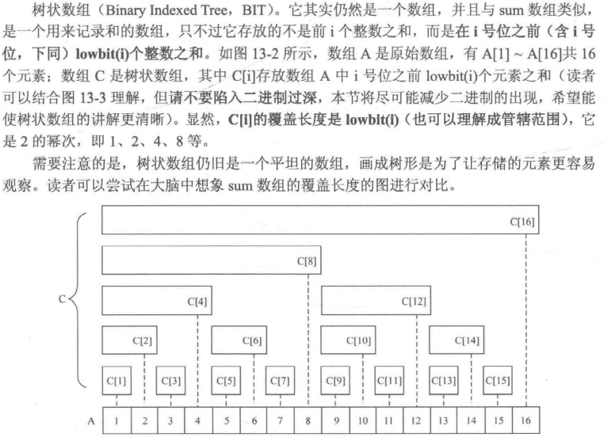

```markdown
c0001=a0001
c0010=a0001+a0010
c0011=a0011
c0100=a0001+a0010+a0011+a0100
```

你会发现，将每一个二进制，**去掉所有高位1，只留下最低位的1，然后从那个数一直加到1**，看一看是不是这样。

上面的示例和这句话解释了为什么在更新操作的时候每次加`lowbit(x)`。


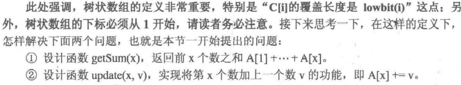


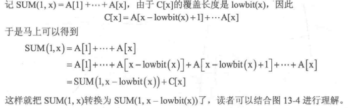

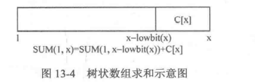


由`A[1] + ... + A[14] = C[8] + C[12] + C[14]`可以看出覆盖的区间长度越来越大


```cpp
//getSum函数返回前x个整数之和
int getSum(int x)
{
    int sum = 0;  //记录和
    for(int i = x; i > 0; i -= lowbit(i))  //注意是i>0而不是i>=0
        sum += c[i];  //累计c[i]，然后把问题缩小为SUM(1, i - lowbit(i))
    return sum; //返回和
}
```

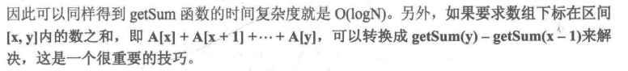

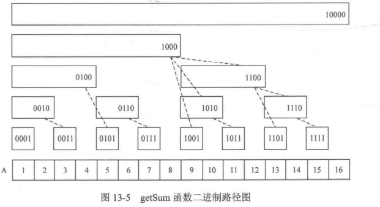


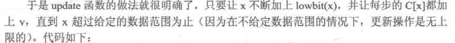

```cpp
//update函数将第x个整数加上v
void update(int x, int v)
{
    for(int i = x; i <= N; i += lowbit(i))  //注意i必须能取到N
        c[i] += v;  //让c[i]加上v，然后让c[i + lowbit(i)]加上v
        
}
```

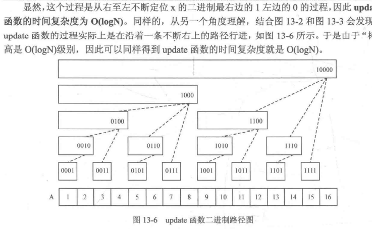

在初始化`c[]`数组的时候可以直接调用`update()`函数，即在输入序列的时候就初始化`c[]`数组


##### P3374

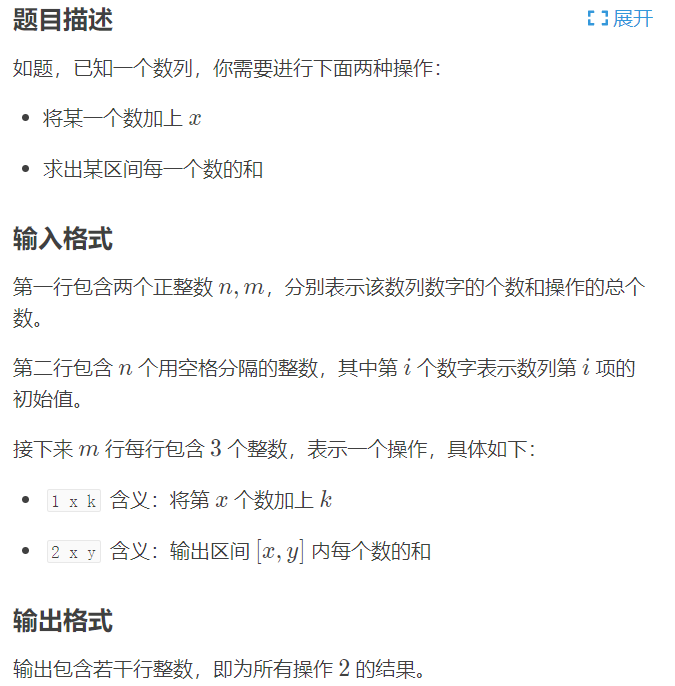

```markdown
输入
5 5
1 5 4 2 3
1 1 3
2 2 5
1 3 -1
1 4 2
2 1 4

输出
14
16
```

```cpp
#include <iostream>
using namespace std;
#define lowbit(x) ((x) & (-x))

const int maxn = 500005;

int c[maxn];
int n, m; //该数列数字的个数，操作的总个数
int getSum(int x)
{
	int sum = 0;
	for (int i = x; i > 0; i -= lowbit(i))
		sum += c[i];
	return sum;
}

//单点修改
void update(int x, int v)
{
	for (int i = x; i <= n; i += lowbit(i))
		c[i] += v;
}

int main(void)
{
	cin >> n >> m;  //数字的个数，操作的总个数
	int op, x, y, k;

	for (int i = 1; i <= n; i++)
	{
		cin >> x;
		update(i, x);
	}

	for (int i = 1; i <= m; i++)
	{
		cin >> op;
		if (op == 1)
		{
			cin >> x >> k;
			update(x, k);
		}
		else if (op == 2)
		{
			cin >> x >> y;
			cout << getSum(y) - getSum(x - 1) << endl;
		}
	}
}
```


#### 区间修改，单点查询

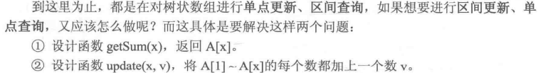


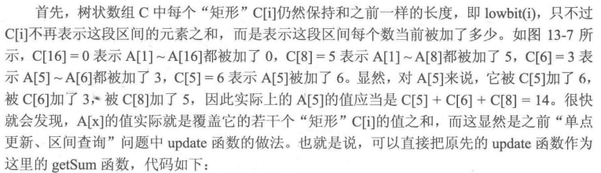

```cpp
//getSum函数返回第x个整数的值
int getSum(int x)
{
    int sum = 0;  //记录和
    for(int i = x; i < maxn; i += lowbit(i))  //沿着i增大的路径
        sum += c[i];  //累计c[i]
    return sum;  //返回和
}
```

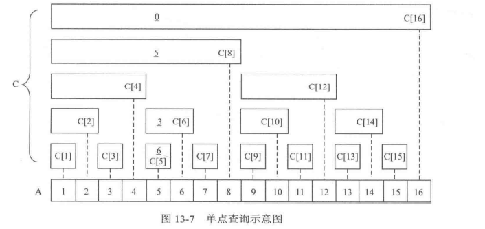

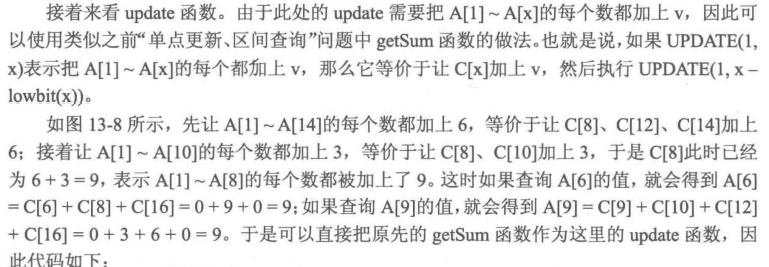

```cpp
//update函数将前x个整数都加上v
void update(int x, int v)
{
    for(int i = x; i > 0; i -= lowbit(i))  //沿着i减小的路径
        c[i] += v;  //让c[i]加上v
}
```

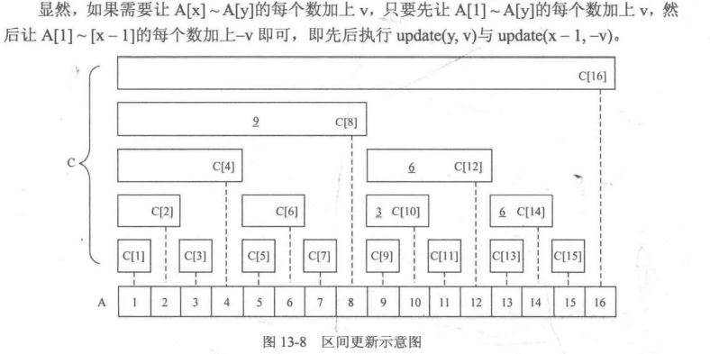

#####P3368

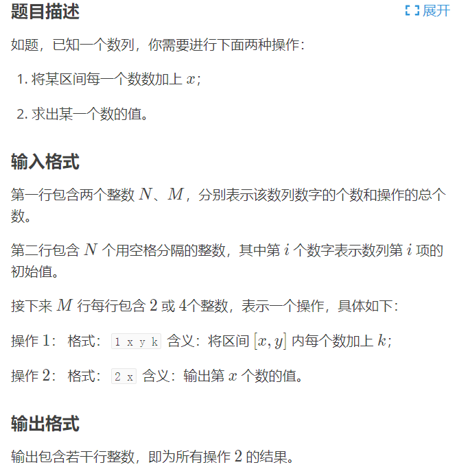

```markdown
输入
5 5
1 5 4 2 3
1 2 4 2
2 3
1 1 5 -1
1 3 5 7
2 4

输出
6
10
```

```cpp
#include <iostream>
using namespace std;
#define lowbit(x) ((x) & (-x))

const int maxn = 500005;

long long c[maxn];
int n, m; //该数列数字的个数，操作的总个数
long long getSum(int x)
{
	long long sum = 0;
	for (int i = x; i <= n; i += lowbit(i)) //找到在范围内覆盖到第x位的所有位即可
		sum += c[i];
	return sum;
}

//区间修改
void update(int x, int v)
{
	for (int i = x; i > 0; i -= lowbit(i))
		c[i] += v;
}

int main(void)
{
	cin >> n >> m;  //数字的个数，操作的总个数
	int op, x, y, k;

	for (int i = 1; i <= n; i++)
	{
		cin >> x;
		update(i, x);
		update(i - 1, -x);
	}

	for (int i = 1; i <= m; i++)
	{
		cin >> op;
		if (op == 1)
		{
			cin >> x >> y >> k;
			update(y, k);
			update(x - 1, -k);
		}
		else if (op == 2)
		{
			cin >> x;
			cout << getSum(x) << endl;
		}
	}
}
```

