## 二叉堆

### 概念

二叉堆本质上是一种完全二叉树，它分为两个类型：最大堆和最小堆

什么是最大堆呢？最大堆任何一个父节点的值，都**大于等于**它左右孩子节点的值。

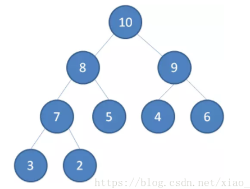

什么是最小堆呢？最小堆任何一个父节点的值，都**小于等于**它左右孩子节点的值。

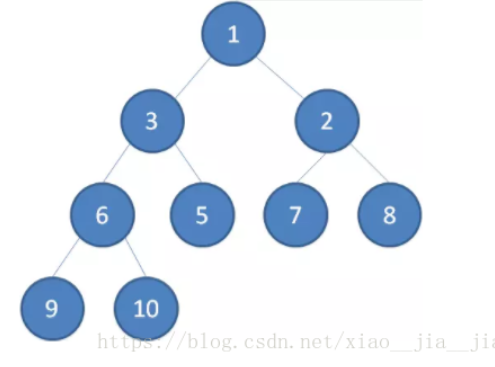

二叉堆的根节点叫做**堆顶**。

最大堆和最小堆的特点，决定了在最大堆的堆顶是整个堆中的**最大元素**；最小堆的堆顶是整个堆中的**最小元素**。

明确一点：

二叉堆虽然是一颗完全二叉树，但它的存储方式并不是链式存储，而是顺序存储。换句话说，二叉堆的所有节点都存储在数组当中。

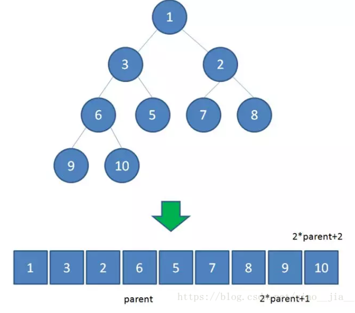

### 操作

#### 插入结点

二叉堆的节点插入，插入位置是完全二叉树的最后一个位置。比如我们插入一个新节点，值是 0。

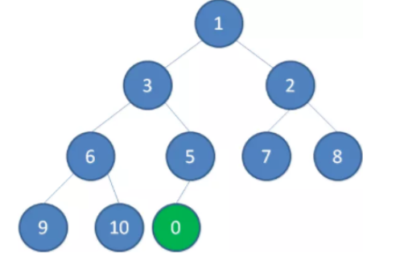

这时候，我们让节点0的它的父节点5做比较，如果0小于5，则让新节点“上浮”，和父节点交换位置。

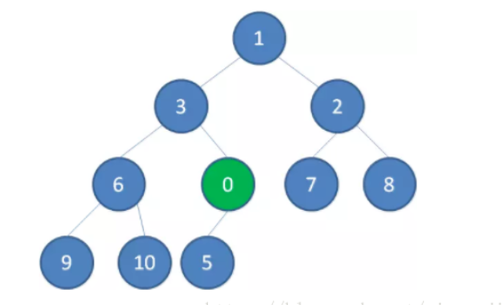

继续用节点0和父节点3做比较，如果0小于3，则让新节点继续“上浮”。

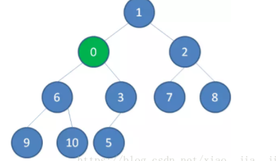

继续比较，最终让新节点0上浮到了堆顶位置。

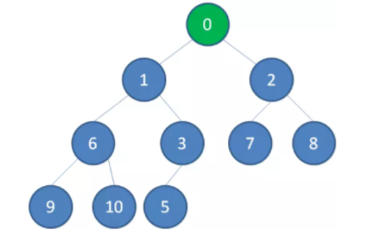

#### 删除结点

二叉堆的节点删除过程和插入过程正好相反，所删除的是处于堆顶的节点。比如我们删除最小堆的堆顶节点1。

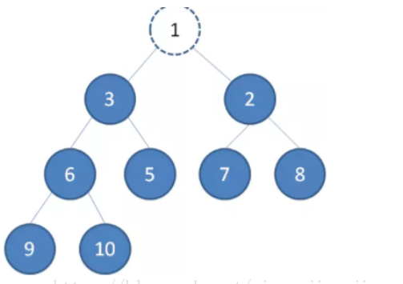

这时候，为了维持完全二叉树的结构，我们把堆的最后一个节点10补到原本堆顶的位置。

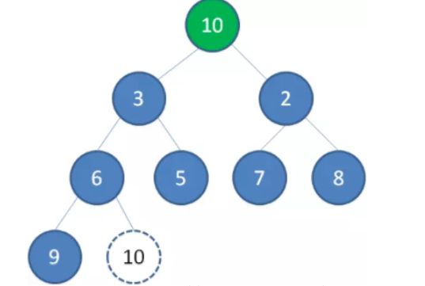

接下来我们让移动到堆顶的节点10和它的左右孩子进行比较，如果左右孩子中最小的一个（显然是节点2）比节点10小，那么让节点10“下沉”。

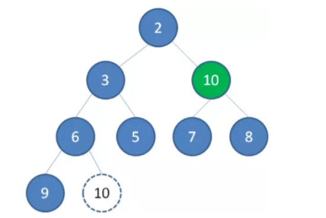

继续让节点10和它的左右孩子做比较，左右孩子中最小的是节点7，由于10大于7，让节点10继续“下沉”。

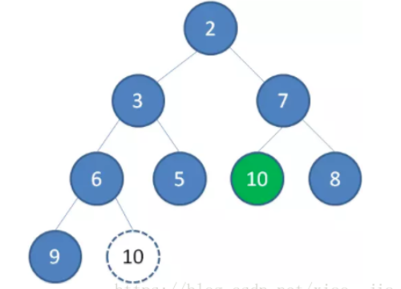

这样一来，二叉堆重新得到了调整。

#### 构建二叉堆

构建二叉堆，也就是把一个无序的完全二叉树调整为二叉堆，本质上就是让**所有非叶子节点依次下沉**。

我们举一个无序完全二叉树的例子：

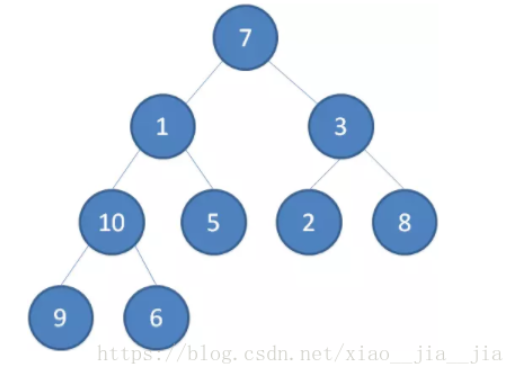

首先，我们从最后一个**非叶子**节点开始，也就是从节点10开始。如果节点10大于它左右孩子中最小的一个，则节点10下沉。

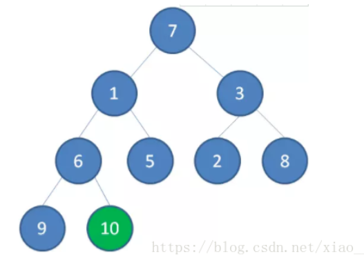

接下来轮到节点3，如果节点3大于它左右孩子中最小的一个，则节点3下沉。

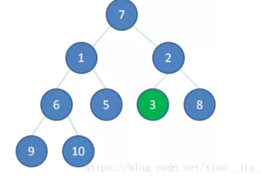

接下来轮到节点1，如果节点1大于它左右孩子中最小的一个，则节点1下沉。事实上节点1小于它的左右孩子，所以不用改变。

接下来轮到节点7，如果节点7大于它左右孩子中最小的一个，则节点7下沉。

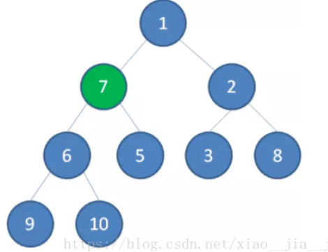

节点7继续比较，继续下沉。

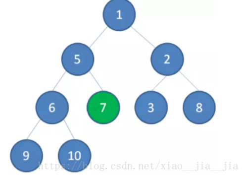

这样一来，一颗无序的完全二叉树就构建成了一个最小堆。

